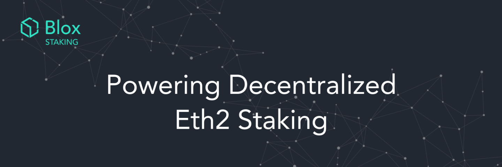

 
 

# SSV - Secret Shared Validator

[comment]: <> ([![Travis]&#40;https://travis-ci.com/ethereum/eth2-ssv.svg?branch=stage&#41;]&#40;https://travis-ci.com/ethereum/eth2-ssv&#41;)

## Introduction

Secret Shared Validator ('SSV') is a unique technology that enables the distributed control and operation of an Ethereum validator.

SSV uses an MPC threshold scheme with a consensus layer on top ([Istanbul BFT](https://arxiv.org/pdf/2002.03613.pdf)), 
that governs the network. \
Its core strength is in its robustness and fault tolerance which leads the way for an open network of staking operators 
to run validators in a decentralized and trustless way.

## Information

### General SSV information (Semi technical read)
* Article by [Blox](https://medium.com/bloxstaking/an-introduction-to-secret-shared-validators-ssv-for-ethereum-2-0-faf49efcabee)
* Article by [Mara Schmiedt and Collin Mayers](https://medium.com/coinmonks/eth2-secret-shared-validators-85824df8cbc0)

### Technical iBFT and SSV read
* [iBFT Paper](https://arxiv.org/pdf/2002.03613.pdf)
* [iBFT annotated paper (By Blox)](./ibft/IBFT.md)
* [EIP650](https://github.com/ethereum/EIPs/issues/650)

## Getting Started

The following documents contains instructions and information on how to get started:
* [An SSV operator's getting started](./docs/OPERATOR_GETTING_STARTED.md)
* [How to setup an operator on AWS](./docs/OPERATOR_GETTING_STARTED.md#setting-aws-server-for-operator)
* [Developers' Guide](./docs/DEV_GUIDE.md)

## Contribution

Thank you for considering a contribution to the source code.

In order to contribute to eth2-ssv, please fork, add your code, commit and send a pull request
for the maintainers to review and merge into the main code base.\
If you wish to submit more complex changes though, please check up with the core devs first on [our discord](https://discord.gg/eDXSP9R)
to ensure those changes are in line with the general philosophy of the project and/or get
some early feedback which can make both your efforts much lighter as well as our review
and merge procedures quick and simple.

Please see the [Developers' Guide](./docs/DEV_GUIDE.md)
for more details on configuring your environment, managing project dependencies, and
testing procedures.

## License

The eth2-ssv library (i.e. all code outside of the `cmd` directory) is licensed under the
[GNU Lesser General Public License v3.0](https://www.gnu.org/licenses/lgpl-3.0.en.html),
also included in our repository in the `LICENSE` file.

The eth2-ssv binaries (i.e. all code inside of the `cmd` directory) is licensed under the
[GNU General Public License v3.0](https://www.gnu.org/licenses/gpl-3.0.en.html), also
included in our repository in the `LICENSE` file.

## Road Map
[X] Free standing, reference iBFT Go implementation\
[X] SSV specific iBFT implementor\
[X] Port POC code to Glang\
[ ] Single standing instance running with Prysm's validator client\
[X] Networking and discovery\
[X] db, persistance and recovery\
[ ] Between instance persistence (pevent starting a new instance if previous not decided)\
[ ] Multi network support (being part of multiple SSV groups)\
[ ] Aggregation and Proposal support\
[X] Key sharing\
[X] Deployment\
[\\] Documentation\
[X] Phase 1 testing\
[ ] Audit

** X=done, \\=WIP

