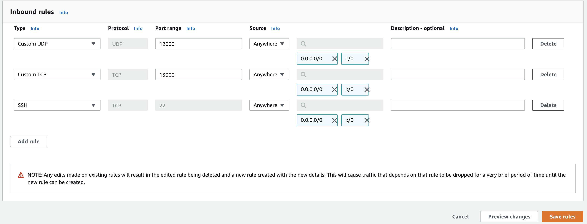

[](https://www.bloxstaking.com/)

<br>
<br>

# SSV - Operator Getting Started Guide

- [SSV - Operator Getting Started Guide](#ssv---operator-getting-started-guide)
  - [Setting AWS Server for Operator](#setting-aws-server-for-operator)
    - [1. Setup](#1-setup)
    - [2. Login with SSH](#2-login-with-ssh)
    - [3. Pre-requisite](#3-pre-requisite)
    - [4. Generate Operator Keys](#4-generate-operator-keys)
      - [Password file](#password-file)
      - [Key pair generation and encryption](#key-pair-generation-and-encryption)
    - [5. Create a Configuration File](#5-create-a-configuration-file)
      - [5.1 Logger Configuration](#51-logger-configuration)
      - [5.2 Metrics Configuration](#52-metrics-configuration)
      - [5.3 Profiling Configuration](#53-profiling-configuration)
    - [6. Start SSV Node in Docker](#6-start-ssv-node-in-docker)
    - [7. Update SSV Node Image](#7-update-ssv-node-image)
    - [8. Setup Monitoring](#8-setup-monitoring)

## Setting AWS Server for Operator

This section details the steps to run an operator on AWS.

### 1. Setup

Create a server of your choice and expose it on ports 12001 UDP and 13001 TCP
- In the search bar search for "ec2" and then click on EC2 in the search results
- In the EC2 Dashboard, select Launch Instance
- Select "Ubuntu Server 20.04"
- Choose "t2.micro" (free tier, should be selected by default)
- Go to the "Configure Security Group" tab at the top
- Make sure you have 3 rules (use the Add Rule button as necessary) - Custom UDP, Custom TCP and SSH, and make sure to set their Port Range and Source attributes as seen in the screenshot below -

- Click on "Review and Launch" and then "Launch"
- In the key pair pop-up, select "Create a new key pair" in the drop-down, then name this key pair and download it
- Click Launch Instances and then View Instances
- In the instances table, take note of the Public IP of your newly created instance

### 2. Login with SSH

Mac\Linux:

```
$ cd ./{path to the folder to which the key pair file was downloaded}

$ chmod 400 {key pair file name}

$ ssh -i {key pair file name} ubuntu@{instance public IP}

type yes when prompted
```

Windows:
```
cd\{path to the folder to which the key pair file was downloaded}

ssh -i {key pair file name} ubuntu@{instance public IP}

type yes when prompted
```

### 3. Pre-requisite

A fundamental pre-requisite is to have Docker installed on the machine hosting the SSV Node. In order to do so, please refer to [the official Docker documentation](https://docs.docker.com/engine/install/), and find the option that better fits your server configuration.

> ℹ️ In order to run the SSV Node, in a server, only Docker engine is necessary, you can still go ahead and install Docker Desktop, but it will not be necessary unless you plan to use the Graphical Interface.

As a shortcut, the installation script linked below can install the necessary packages for Ubuntu.

```
$ sudo su

$ wget https://raw.githubusercontent.com/bloxapp/ssv/main/install.sh

$ chmod +x install.sh

$ ./install.sh
```

### 4. Generate Operator Keys

#### Password file

You will need to create a file (named `password` in this example) containing the password you chose for your Secret Key:

```bash
echo "<MY_OPERATOR_PASSWORD>" >> password
```

#### Key pair generation and encryption

The node Docker image will generate keys for you, then encrypt them with a password you provide, using the following command:

```bash
docker run --name ssv-node-key-generation -v "$(pwd)/password":/password -it "bloxstaking/ssv-node:latest" /go/bin/ssvnode generate-operator-keys --password-file=password && docker cp ssv-node-key-generation:/encrypted_private_key.json ./encrypted_private_key.json && docker rm ssv-node-key-generation
```

Here is an example of the generated file.

```json
{
  "checksum": {
    "function": "sha256",
    "message": "affa5deb755d8ad13a039117dc6850d2a25ad62a870a1e1f8d4ef...",
    "params": {}
  },
  "cipher": {
    "function": "aes-128-ctr",
    "message": "3022f3b5043b77eda7f336dd0218e6b7e633a3f42f7ae92ed9...",
    "params": { "iv": "12e787716b0e3c30f2d68ed05464c16f" }
  },
  "kdf": {
    "function": "pbkdf2",
    "message": "",
    "params": {
      "c": 262144,
      "dklen": 32,
      "prf": "hmac-sha256",
      "salt": "bc71d3213fe17f15879e6bc468b30eeeb2d0969176491d87f9b00a37bf314a4c"
    }
  },
  "publicKey": "LS0tLS1CRUdJTiBSU0EgUFVCTElDIEtFWS0tLS0tCk1JSUJJak..."
}
```

> ℹ️ Pay close attention to the `publicKey` field, as the name says, it contains the public key, which is needed to register the Operator on the ssv.network

### 5. Create a Configuration File

Copy the following `config.yaml` file, just be sure to replace all the placeholders (`ETH2_NODE`, `ETH1_WEBSOCKET_ADDRESS`, `OPERATOR_SECRET_KEY`, etc.) with actual values.

In particular, substitute `ENCRYPTED_PRIVATE_KEY_JSON` with the operator encrypted private key file [generated above](#4-generate-operator-keys) (e.g. `encrypted_private_key.json`) and `PASSWORD_FILE` with the file containing the password used to generate the encrypted key itself.

```yaml
global:
  # Console output log level 
  LogLevel: info

  LogFormat: console
 
  LogLevelFormat: capitalColor

  # Debug logs file path
  LogFilePath: ./data/debug.log

db:
  # Path to a persistent directory to store the node's database.
  Path: ./data/db

ssv:
  # The SSV network to join to
  # Mainnet = Network: mainnet (default)
  # Testnet (Goerli)  = Network: jato-v2
  # Testnet (Holesky) = Network: holesky
  Network: mainnet
  
  ValidatorOptions:
    # Whether to enable MEV block production. Requires the connected Beacon node to be MEV-enabled.
    BuilderProposals: false

eth2:
  # HTTP URL of the Beacon node to connect to.
  BeaconNodeAddr: <ETH2_NODE> # e.g. http://example.url:5052

eth1:
  # WebSocket URL of the Eth1 node to connect to.
  ETH1Addr: <ETH1_WEBSOCKET_ADDRESS> # e.g. ws://example.url:8546/ws

p2p:
  # Optionally provide the external IP address of the node, if it cannot be automatically determined.
  # HostAddress: 192.168.1.1

  # Optionally override the default TCP & UDP ports of the node.
  # TcpPort: 13001
  # UdpPort: 12001

KeyStore:
  PrivateKeyFile: <ENCRYPTED_PRIVATE_KEY_JSON> # e.g. ./encrypted_private_key.json
  PasswordFile: <PASSWORD_FILE> # e.g. ./password

# This enables monitoring at the specified port, see https://docs.ssv.network/run-a-node/operator-node/maintenance/monitoring
MetricsAPIPort: 15000

EnableProfile: true
```

> ⚠️ Make sure your `ETH1Addr` endpoint is communicating **over WebSocket** and **not over HTTP** in order to support subscriptions and notifications.


  #### 5.1 Logger Configuration

  In order to see `debug` level logs, change the corresponding section to the `config.yaml` by running:

  ```yaml
  LogLevel: debug
  ```

  Logs can be formatted as `json` instead of the default `console` format:

  ```yaml
  LogFormat: console
  ```

  Log levels can be shown in lowercase and w/o colors, default is upper case with colors:

  ```yaml
  LogLevelFormat: lowercase
  ```

  #### 5.2 Metrics Configuration

  The sample config file provided above already has metrics enabled, through the corresponding config:

  ```yaml
  MetricsAPIPort: 15000
  ```

  See [setup monitoring](#8-setup-monitoring) for more details.

  #### 5.3 Profiling Configuration

  The sample config file provided above already has profiling enabled, through the corresponding config:

  ```
  EnableProfile: true
  ```

### 6. Start SSV Node in Docker

Before start, make sure the clock is synced with NTP servers. 
Then, run the docker image in the same folder you created the `config.yaml`:

```shell
docker run -d --restart unless-stopped --name ssv_node -e \
</strong>CONFIG_PATH=/config.yaml -p 13001:13001 -p 12001:12001/udp -p 15000:15000 \
-v "$(pwd)/config.yaml":/config.yaml \
-v "$(pwd)":/data \
-v "$(pwd)/password":/password \
-v "$(pwd)/encrypted_private_key.json":/encrypted_private_key.json \
-it "bloxstaking/ssv-node:latest" make BUILD_PATH="/go/bin/ssvnode" start-node && \
docker logs ssv_node --follow
```

> ℹ️ This command will keep the terminal busy, showing the container's logs. It is useful to make sure that the node start up sequence runs correctly.
> 
> You can detach the terminal at any time by hitting `Ctrl-c` key combination, or closing the terminal itself.

### 7. Update SSV Node Image

To verify the current version of a node, launch this command:

```shell
$ docker run --rm -it 'bloxstaking/ssv-node:latest' /go/bin/ssvnode version
```

In order to update, stop any running container (usually `docker stop ssv_node`) and pull the `latest` image (or any specific version `bloxstaking/ssv-node:<version>`)

```shell
$ docker rm -f ssv_node && docker pull bloxstaking/ssv-node:latest
```

Now run the container again as specified above in step 6.

### 8. Setup Monitoring

To set up monitoring on the node, [please follow the instructions in the dedicated page](../monitoring/README.md).
