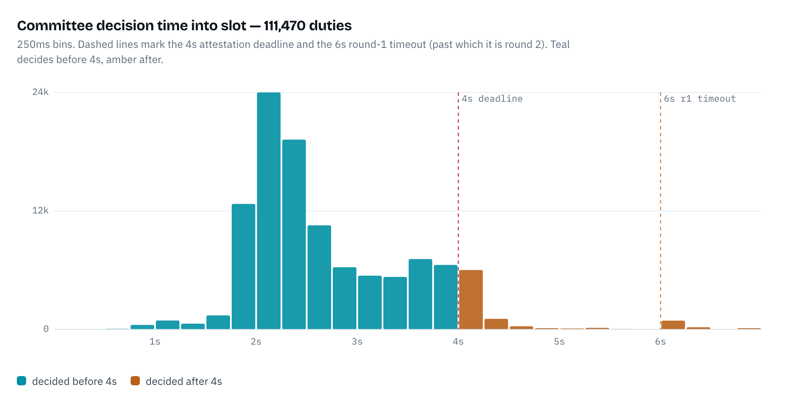
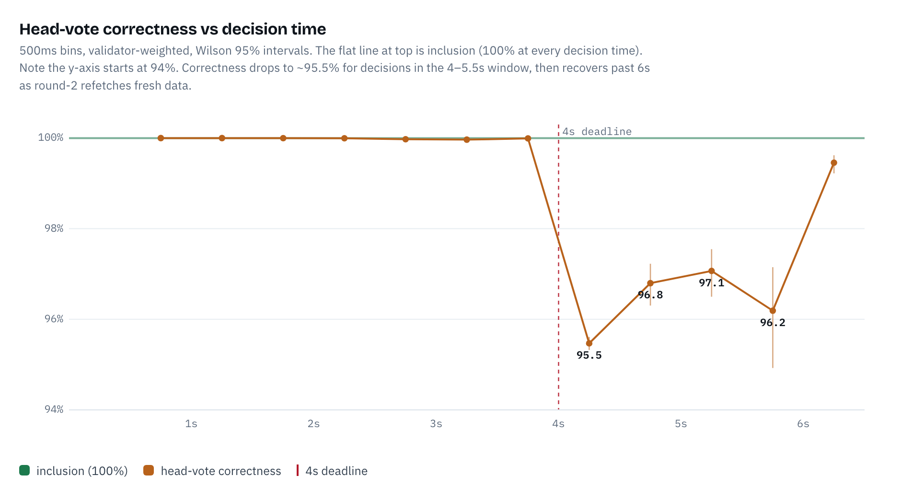
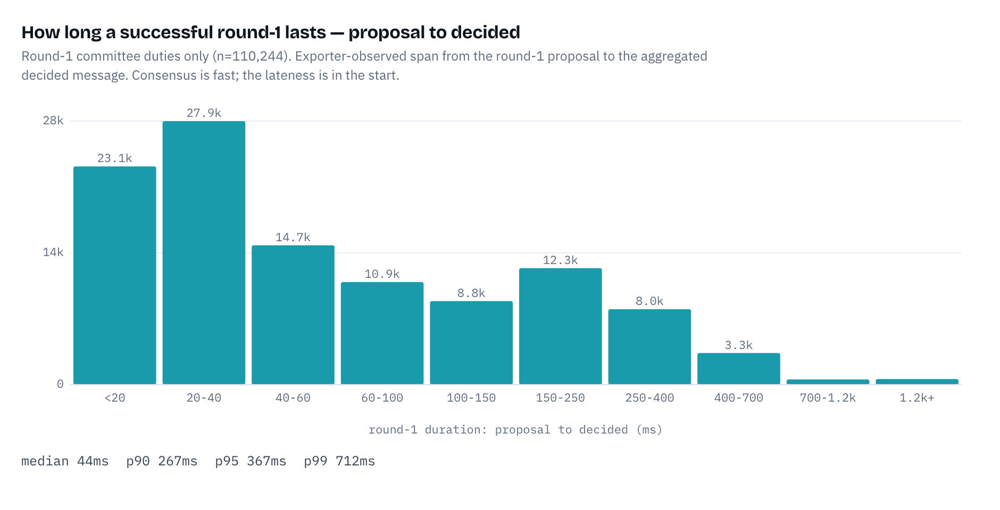
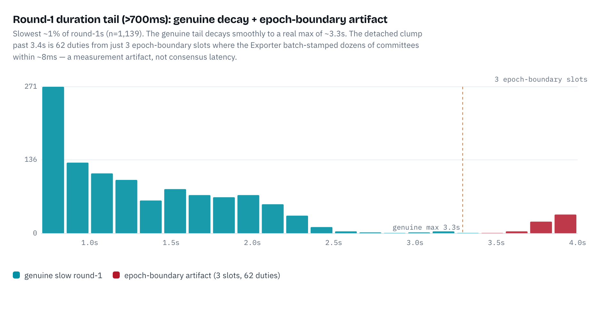

# Attester QBFT Decision-Timing Analysis

Where attester (committee) QBFT consensus decides within the slot, and whether that timing costs anything on-chain. Companion to the [proposer decision-timing analysis](../proposer-decision-timing/README.md) and to [#2883](https://github.com/ssvlabs/ssv/pull/2883), scoped to the **attester** duty. SSV runs one QBFT per `(committee, slot)` for attestations, so the unit here is the committee-duty, and the on-chain outcome (inclusion, head vote, inclusion distance) is per validator, rolled up per committee-duty.

**Window:** Ethereum **mainnet**, epochs `465250`–`472000` (30 days), **sampled one epoch per day** (attester volume is ~1000× proposer, so full enumeration isn't practical — same approach as #2883). **111,470** committee-duties, **1.84M** validator-attestations.

## TL;DR

- **Attester decides late by design.** Median decision is **2,430ms** into the slot, **30.6%** decide after 3s and **8.3%** after the 4s attestation deadline — because the committee round-1 timer is slot-anchored at **6s** (a `slotDuration/3` head-start), vs the proposer's 2s. Timings that would orphan a block.
- **…and lateness barely matters.** Every one of the 1.84M *decided* attestations was included on-chain, at every decision time including past 6s. Inclusion distance stays optimal (~99.6%). The real, timing-independent miss rate — committees that never reach a decided attestation — is **0.063%** (E2M ground truth, see caveats).
- **The one measurable cost is head-vote quality, right at 4s.** Head-vote correctness holds at ~100% until the deadline, drops to **95.5%** for decisions in the 4–5.5s window (a late decision usually means a late block, so the vote recorded a stale head), then **recovers past 6s** as round-2 refetches fresh data.
- **Round 2 is benign here — the opposite of proposer.** Round changes are more common (**1.09%** vs 0.17%) but harmless: round-2 attestations are 100% included and their refetch *restores* head-vote correctness. For a proposer, round 2 meant a 14% miss rate.
- **Round-1 consensus is fast; the lateness is all in the start.** Proposal→decided is a median **44ms** (p99 712ms); a committee's decision time is essentially its late *start* (median proposal at 2.3s) plus a near-zero tail. The genuine duration tail tops out at ~3.3s.

## Interactive report

[`attester-qbft-decision-timing.html`](./attester-qbft-decision-timing.html) — the full decision-timing / outcome / round-1 / round-change analysis (open via [htmlpreview.github.io](https://htmlpreview.github.io/) by pasting the file's GitHub URL, or download and open locally).

## Data & method

**Sources.** (1) Exporter committee traces — per `(committee, slot)`: consensus rounds, the `decideds` aggregated-commit ("decided") message, and the attester `validatorIdx` set. The endpoint returns every committee for a slot range with no `CommitteeIDs`, so one request per epoch covers the whole network. (2) E2M `/api/duties` — every attester duty in the epoch with its `InclusionSlot`, `EarliestInclusionSlot`, and `CorrectHeadVote`. The two are joined on `(slot, validator)` and rolled up per committee-duty.

**Decision time** is the Exporter's receive-time of the aggregated *decided* message (a commit carrying ≥2f+1 signers), minus slot start (`genesis + slot·12s`). The committee round-1 timer is slot-anchored at `slotDuration/3 + 2s = 6s`, round 2 at 8s — see [`protocol/v2/qbft/roundtimer/timer.go`](../../../protocol/v2/qbft/roundtimer/timer.go) (proposer timeouts, by contrast, are instance-relative).

**No `ProposerDelay` / no drift lens.** `ProposerDelay` is proposer-only, and committee duties do no MEV block-fetch, so operator-start drift is smaller and less interesting here.

## 1. When the committee decides



The distribution peaks at ~2.5s and spreads to 4–6s. Because round 1 runs to 6s, deciding after 3s is *normal*, not a failure:

| threshold | committee-duties | share |
|---|--:|--:|
| decide > 3s | 34,091 | 30.6% |
| decide > 4s | 9,281 | 8.3% |
| decide > 5s | 1,648 | 1.5% |
| decide > 6s | 1,307 | 1.2% |

Rounds: **98.9%** decide in round 1, **1.07%** (1,192) in round 2, 19 later. Every sampled committee-duty reached a decided trace.

## 2. Inclusion is insensitive; only head-vote is (and only at 4s)



Every *decided* attestation was included, at every decision time. What the 4s deadline actually costs is head-vote correctness — and round 2 heals it:

| decision band | duties | attestations | inclusion | head-vote | optimal-incl |
|---|--:|--:|--:|--:|--:|
| <2s | 16,385 | 308,611 | 100.000% | 100.00% | 99.55% |
| 2–3s | 60,974 | 1,011,794 | 100.000% | 99.99% | 99.56% |
| 3–4s | 24,805 | 420,281 | 100.000% | 99.98% | 99.99% |
| **4–5s** | 7,657 | 86,722 | 100.000% | **95.55%** | 99.40% |
| 5–6s | 342 | 5,146 | 100.000% | 96.87% | 99.03% |
| >6s | 1,307 | 7,324 | 100.000% | 99.55% | 99.73% |

Unlike a block proposal (orphaned if it lands after ~4s), an attestation can be included up to 32 slots later and here essentially always makes the very next block. So a committee can decide at 5–6s and still land on-chain; it just may have recorded a slightly stale head if it decided in the 4–6s round-1-late window — a *common-cause* effect (a late/absent block drives both the late decision and the stale head), which the round-2 refetch past 6s corrects.

## 3. Round-1 anatomy: late start, near-instant consensus



The lateness is entirely in the *start*, not the consensus. Once the round-1 leader proposes (median **2.3s** into the slot, waiting on the block and attestation data), the committee reaches a decided quorum in a median of **44ms** — 60% within 100ms, 89% within 250ms of the proposal (p90 267ms, p99 712ms).



Zooming the p99–max tail: the genuine tail decays smoothly to a real max of **~3.3s**, concentrated in specific committees — some chronic round-changers, others "slow but steady" (one persistently-slow-but-alive operator that drags round-1 to 1–2s without ever timing out). The detached clump past 3.4s is **62 duties from just 3 epoch-boundary slots** where the Exporter batch-stamped dozens of committees' decided messages within ~8ms of each other — a measurement artifact (independent QBFT instances can't align to <10ms), not consensus latency.

## 4. Why round changes are ~6× more common than for proposals

The 1.09% rate (vs the proposer's 0.17%) has three compounding causes:

- **A few unhealthy committees dominate.** 113 of 331 committees ever round-change, and the **worst 10 account for 60%** of all round changes — several at **25–29%** of their own duties. Operator health in specific clusters, not a network property.
- **A structural timer difference makes committee round-1 tighter.** The committee round-1 timer fires at a fixed `slotStart + 6s`, whereas the proposer's is instance-relative — a full 2s from consensus start (see [`timer.go`](../../../protocol/v2/qbft/roundtimer/timer.go)). Committees start consensus late (median 2.3s, p99 4.2s into slot), so their effective round-1 budget is only `6s − start`: ~3.7s typically, but under 2s and shrinking for late starters. The same operator slowness blows a shrinking budget far more easily than the proposer's always-fresh 2s. Strikingly, **0.177% of committee round-1s last >2s** (surviving only because of the bigger budget) — about the proposer's 0.17% round-change rate; give the committee the proposer's 2s ceiling and that slow-formation tail would roughly convert into round-changes.
- **Late blocks add a systemic nudge.** The round-change rate roughly doubles (1.0% → ~2.0%) at slots where committees decide late, clustering up to 13% of a slot's committees together — a late/contested block leaves operators transiently disagreeing on the head, so round 1 misses its prepare-quorum and round 2 (after the head settles) agrees.

**Why the tail is fatter than the proposer's at all** — even below any timeout, committee round-1 (p99 712ms) is fatter-tailed than proposer (p99 191ms). Both duties gate consensus on a per-operator CL call, but the proposer validates a *self-contained block* it can accept the instant the proposal arrives (a local check — [`value_check.go`](../../../protocol/v2/ssv/value_check.go) `proposerChecker`), building on the *settled* parent, so operator readiness clusters tightly. A committee operator instead fetches attestation data from its *own* beacon node ([`runner/committee.go`](../../../protocol/v2/ssv/runner/committee.go)) and validates the proposed vote against that self-derived value — so it can only participate once its node has determined the *current* slot's head, which is still arriving. Waiting on an arriving block is inherently more variable than building on a settled one, so the marginal operator lags further and the tail runs longer.

## Proposer vs attester

| | median decide | decide >3s | round-2 rate | round-2 outcome | 4s deadline |
|---|--:|--:|--:|---|---|
| **Proposer** | 1,437ms | 0.11% | 0.17% | 14.3% miss | hard cliff (100% miss >4s) |
| **Attester (committee)** | 2,430ms | 30.6% | 1.07% | 100% included | soft (head-vote dip only) |

For proposals, decision timing is everything; for attestations, it's nearly free.

## Caveats

- **Inclusion is conditional on a decided trace.** The dataset is keyed on Exporter committee traces, so it contains only attestations the committee actually decided and submitted — hence 0 non-inclusions among the 1.84M analysed. Measured directly from E2M over the same 30 epochs, the *overall* attester rate is **99.937% included / 0.063% missed** (1,169 of 1,855,047) and **99.65%** correct head vote. Every one of those 1,169 misses is absent from the decided traces — the committee never produced a decided attestation, a failure mode upstream of and independent of decision timing. So "a decided attestation always lands" is the precise claim, not "no attestation was ever missed."
- **The head-vote dip is common-cause, not causal.** Head vote is set at attestation-data-fetch time, not at QBFT decide time; a late decision correlates with a late/absent block that drives both. Round-2's refetch is what restores it.
- **Sampled window.** One epoch per day over 30 days (seeded). Rare per-slot events (e.g. the epoch-boundary Exporter artifact in §3) are captured but not exhaustively.
- **Exporter vantage.** Decision and proposal times are the Exporter's receive-times; true operator decisions are a touch earlier (decided broadcast + one gossip hop).

## Reproduce

```
# 1. dataset (30 sampled epochs -> attest.jsonl; needs an ssv-scout workspace + vnet)
cd scripts
SSV_SCOUT_DIR=/path/to/ssv-scout OUT_DIR=./data python collect.py 465250 472000
# 2. headline numbers
python analyze.py ./data/attest.jsonl
# 3. chart data embedded in the HTML page
python charts.py ./data/attest.jsonl     # -> attest_summary.json
```

The interactive page embeds `attest_summary.json` (the `const D={...}` object at the top of its `<script>`); regenerate it with step 3 and re-inject to rebuild.
