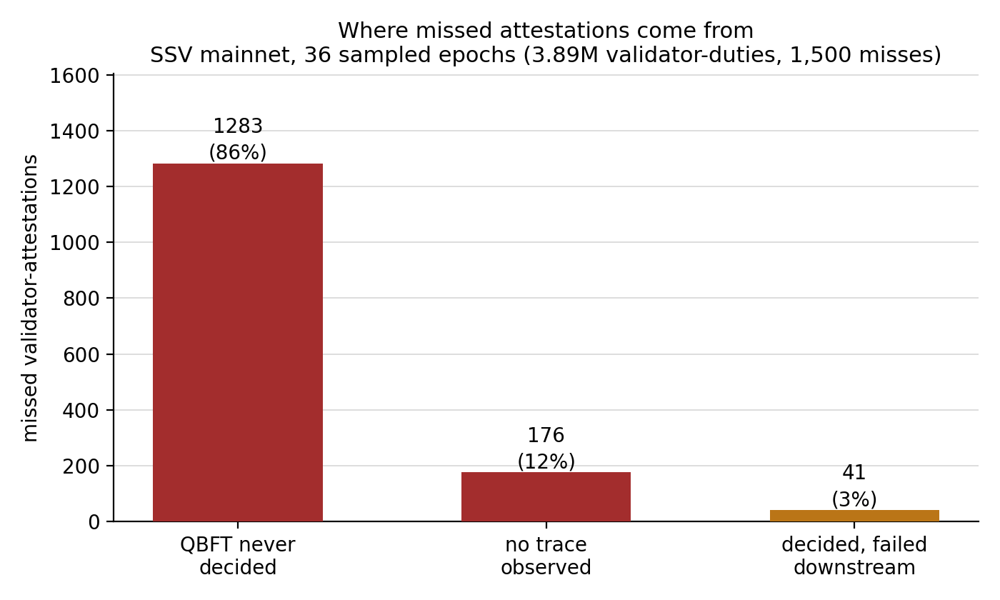
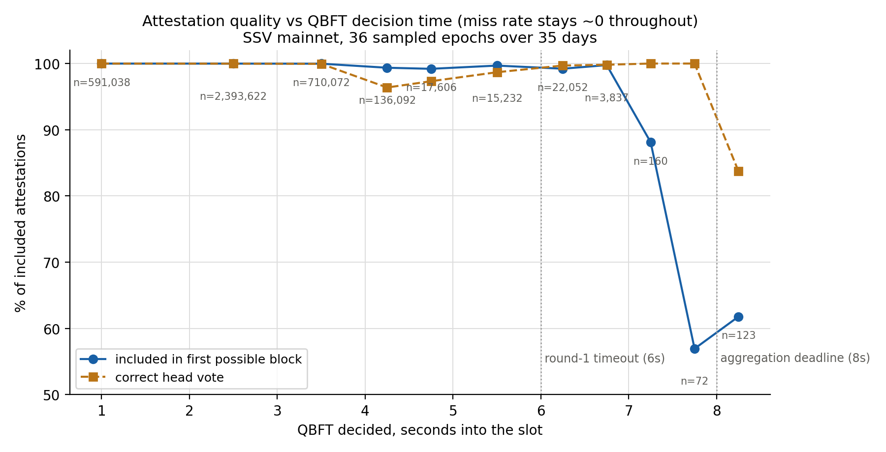
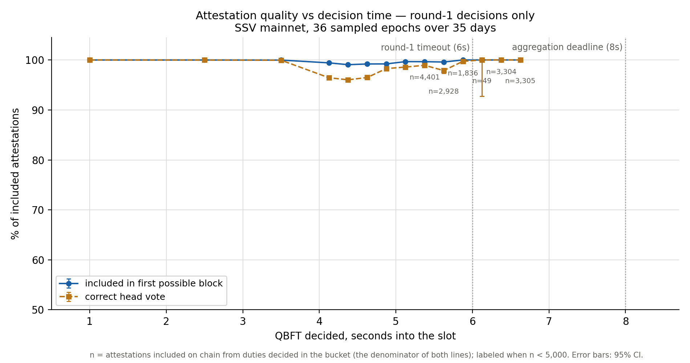
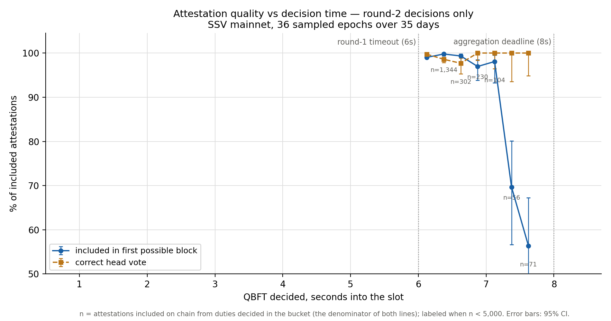

# Committee-duty QBFT decision timing vs attestation outcomes

*June 2026 — SSV mainnet, 35-day window (2026-05-07 → 2026-06-10), network-wide. Rates computed on a stratified sample of 36 epochs (one random epoch per day): 216,243 committee duties covering 3.89M validator-attestations. Complete enumeration of cluster-failure events over the full window (7,732 events) provides the failure forensics.*

This is the committee-duty (attestation) companion to the [proposer analysis](../proposer/README.md), asking the same question for attestations: how does the timing of the committee QBFT decision relate to whether the cluster's attestations land on chain?

## TL;DR — the opposite of the proposer story

For block proposals, decision time is destiny (100% missed past 4.0s into the slot). For committee duties, decision time is **almost irrelevant to inclusion**:

- **0 of the 19,463 attestations from the 2,826 round-2-decided duties were missed** (CI95 ≤ 0.02%); likewise 0 of 128 from round-3+ decisions, and 0 of 355 from the 61 duties decided 7–8.5s into the slot. Round-1 decisions miss 0.0011%. Even the handful of duties decided past 10s were included, ~13 slots late.
- Of the 1,500 missed validator-attestations in the sample, 97% came from duties that never produced a decision: 86% where consensus messages were observed but a decide quorum never formed, and 12% where the exporter saw no consensus activity for the duty at all. The remaining 3% (41 misses, from just four duties) completed consensus early — between 2.3s and 5.1s — and failed after it.

What lateness does cost is **quality, not inclusion**:

- **Inclusion in the first possible block** holds ≥97% through ~7.1s, then falls off sharply: roughly 70% at ~7.4s and ~56% past 7.5s (small samples there — see the error bars) — late attestations increasingly miss the slot+1 aggregate but still get included a slot or two later.
- **Head-vote correctness** dips to ~96.4% for round-1 decisions at 4.0–5.0s — the "no block seen by 4s" fallback path votes for a head that often turns out stale — and *recovers to 99.6%+ for round-2 decisions at 6–7s*. The round-change retry waits long enough for the late block to arrive: **round changes heal head votes**.
- For scale, decided duties split by round as **98.67% round 1** (212,457 duties), **1.31% round 2** (2,826 duties / 19,463 attestations), and **0.013% round 3+** (28 duties / 128 attestations) — everything right of ~6s on this chart describes a small minority of duties.

Conditioning on the decided round separates the two effects — i.e. what the curves would look like if every duty decided in round K:

Round-1 decisions carry the entire 4–5s head-vote dip (the fallback path) but never pay an inclusion-optimality price — they complete well before the danger zone. Round-2 decisions are the mirror image: head votes near-perfect throughout, and the only cost is first-block inclusion once the decision slips past ~7.2s.

## Headline numbers (sampled epochs)

| Question | Result |
|---|---|
| Committee QBFTs that touched round ≥2 | 4,207 of 216,076 traced duties = **1.95%** |
| Decided in round 2 | 2,826 of 215,311 decided duties = **1.31%** (round 3+: 28 duties = 0.013%) |
| Round-1 decision → attestation missed | 41 of 3,870,361 attestations = **0.0011%** |
| Round-2 decision → attestation missed | **0** of 19,463 attestations (CI95 ≤ 0.02%) |
| QBFT never decided → missed | 1,283 of 1,283 attestations = **100%** |
| Overall validator-attestation miss rate | 1,500 of 3,891,411 attestations = **0.039%** |

The first two rows count committee duties (one QBFT each); the miss-rate rows count validator-attestations, since one duty carries the attestations of many validators.

Decision-time distribution: **p50 = 2.42s, p90 = 3.84s, p99 = 6.07s, max = 23.7s** into the slot. The committee QBFT starts when the slot's beacon block arrives (typically ~2s into the slot), with a 4s fallback; round timeouts are slot-aligned — round 1 ends at 6s, round 2 at 8s (`protocol/v2/qbft/roundtimer/timer.go`). Post-consensus signing quorum trails the decision by only 16ms median (p99 ~200ms), so decision time ≈ submission time.

## Full-window cluster-failure forensics

All events where ≥5 validators of one cluster missed together, over the full 35 days (7,732 events; 121 excluded as suspect near a monitoring ingestion gap):

| Category | n | share |
|---|---|---|
| QBFT never decided | 6,275 | 82.4% |
| Decided round 1 (on time), failed downstream | 1,000 | 13.1% |
| No consensus messages observed | 196 | 2.6% |
| Decided round 2 | 133 | 1.7% |
| Decided round 3+ | 7 | 0.1% |
| *Roll-up: decided ≥7.0s into the slot (across the three "decided" rows above)* | **15** | 0.2% |

Of the 1,140 failure events that did reach a decision (rounds 1, 2, and 3+ combined), only 15 decided at 7.0s or later — 98.7% decided with comfortable margin before the aggregation deadline, so their failures happened after consensus, not because of its timing.

Failures are heavily concentrated: **five chronically-failing clusters account for 82% of all cluster-failure events** (the worst single cluster alone is 39%). Attestation reliability on mainnet is an operator-health problem, not a consensus-timing problem.

## Method

- **Duties, rounds, timing**: exporter committee traces (`/v1/exporter/traces/committee`), one request per committee × epoch, reduced to compact per-duty rows at fetch time. Committee IDs are computed locally from operator sets (sha256 over sorted uint32-LE operator IDs, per `ssv-spec` `GetCommitteeID`). Trace coverage: 99.92%. The trace response's schedule provides assigned validators per slot, which also yields a per-epoch validator→cluster map.
- **Outcomes**: SSV Labs' internal duty monitor (e2m) per-validator attestation rows — included/missed, inclusion slot (delay), head-vote correctness — for the sampled epochs; `success=false` enumeration over the full window (335,077 misses = 0.041% of ~808M validator-duties) for the forensics.
- **False-negative guard**: the monitor's known whole-committee false-negative mode is triggered by block-ingestion gaps in its database. A full-window scan comparing its block table against the canonical chain (via a public beacon API) found **exactly one** gap slot in 35 days — the previously documented incident — affecting zero sampled misses; forensics events near it were excluded.
- **Decision time** = arrival of the earliest decided-quorum message at the exporter, minus slot start (P2P skew typically ≤300ms).

### Caveats

- The ≥8s region is thin in the sample (n≈128 duties); conclusions there lean on the full-window forensics, which point the same way.
- Zero observed misses in round 2/3+ bounds the rate by sample size, not to literal zero.
- Scattered misses of 1–4 validators within decided duties exist (they are the 0.0011%) and are not part of the ≥5-validator forensics set.

## Implications

- **There is no attestation analog of the proposer 4s cliff** within the operationally reachable range — the aggregation pipeline tolerates decisions at least up to ~8.5s, with quality (inclusion optimality, hence rewards) degrading from ~7s. Consensus-timing tuning has little to gain for attestations.
- **Round changes are benign-to-positive for committee duties**: they cost inclusion nothing in this window, and they systematically improve head-vote correctness versus the 4s no-block fallback.
- **Reliability work should target cluster health**: the dominant failure mode is consensus never completing — concentrated in a handful of operators — followed by on-time decisions failing at submission. Monitoring and operator outreach beat protocol-timing changes here.

## Reproduction

The pipeline (committee enumeration → sampled trace fetch → outcome join → gap scan → forensics → charts) lives in the internal `ssv-scout` repository under `analysis/committee-qbft-timing/`; all fetch steps are resumable. Exporter trace retention on mainnet (~5 weeks) bounds the window.
