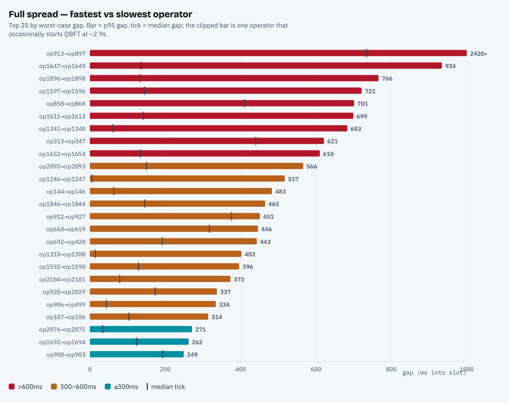
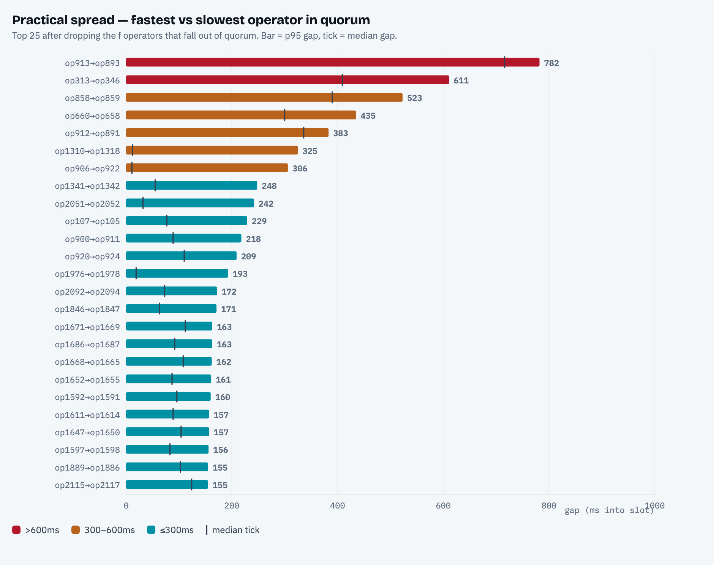

# Operator QBFT-Start Drift

Within a cluster, how far apart its operators start QBFT for a proposer duty — the clock + block-fetch spread *between* operators of the same cluster. Companion to the [proposer decision-timing analysis](../proposer-decision-timing/README.md), reusing the same 30-day mainnet dataset.

**Window:** Ethereum **mainnet**, epochs `465250`–`472000` (30 days). **85 clusters** measured, covering **97.7% of all proposer duties**.

## TL;DR

- **The network is mostly in sync:** median cluster drift is **112ms**, and 80 of 85 measured clusters keep their operators within 200ms of each other typically.
- **A handful drift badly:** the widest cluster's operators start QBFT anywhere from ~440ms to ~1170ms into the slot depending on who leads — two local block-builders among five MEV-relay fetchers. One operator occasionally starts QBFT at **~2.9s** (a bad-day outlier).
- **Most alarming numbers don't gate consensus:** QBFT needs only `2f+1` of `n` operators, so the `f` slowest fall out of quorum. **14 clusters' worst-case collapses** once the falls-out operator is dropped (e.g. `934 → 157ms`, `517 → 42ms`) — practically fine. **7 clusters** keep a genuine practical drift **>300ms** and are the real concerns.
- **Coverage is by design:** the ~100 unmeasured clusters run 1–2 validators and propose <2.5% of the time; each of their operators would need years to lead enough duties to estimate.

## Interactive report

[`operator-qbft-start-drift.html`](./operator-qbft-start-drift.html) — ranked charts, full tables, and per-operator breakdowns (open via [htmlpreview.github.io](https://htmlpreview.github.io/) or download).

## Method

**The metric.** An operator's QBFT start is observed as its **round-1 proposal time into the slot** on the duties it *leads* — the leader is `committee[slot mod n]`, so every operator is sampled as the leader rotates. Only the leader emits a message at QBFT start (the proposal); non-leaders emit nothing there, which is why the metric needs rotation and is reliable only where **every operator led ≥5 duties** — the 85 higher-volume clusters. Every gap is measured from the **fastest operator's median** start.

**Two spreads.** Both use the convention: the **median (typical) gap** and the **p95 (worst-case) gap**.

- **Full spread** = fastest vs the slowest operator.
- **Practical spread** = fastest vs the slowest operator that still joins the quorum. SSV needs `2f+1` of `n = 3f+1` operators, so the `f` slowest can fall out and don't gate consensus (a 4-op cluster drops its single slowest; 7-op drops two). The drop is applied *per statistic* — the typically-slowest for the median, the worst-on-a-bad-day for the p95 — since on any given duty it is whoever is slowest that misses quorum.

**What it includes.** QBFT start = `slotStart + ProposerDelay + block-fetch`, so the gap blends clock skew, `ProposerDelay` differences, and CL/MEV block-fetch time. Times are the Exporter's receive-times; within a cluster's gap the per-operator network path to the Exporter largely cancels.

## 1. Full spread — fastest vs slowest operator



| cluster (operators) | proposals | fastest op | slowest op | gap median | gap p95 |
|---|--:|---|---|--:|--:|
| `893,894,895,896,897,908,913` | 81 | op913 @ 436ms | op897 @ 1170ms | 734ms | **2420ms** |
| `1647,1648,1649,1650` | 36 | | | 136ms | 934ms |
| `1896,1897,1898,1899` | 62 | | | 133ms | 766ms |
| `1595,1596,1597,1598` | 51 | | | 145ms | 721ms |
| `857,858,859,860` | 48 | op858 @ 1040ms | op860 @ 1450ms | 410ms | 701ms |
| `312,313,346,347` | 59 | op313 @ 643ms | op347 @ 1083ms | 440ms | 621ms |

A short median with a long p95 (e.g. `1647…`: 136 → 934ms) means "operators usually in sync, occasionally one has a bad day." The 2420ms is a single operator that occasionally starts QBFT at ~2.9s.

## 2. Practical spread — fastest vs slowest operator in quorum



Dropping the `f` operators that fall out of quorum. Where this collapses the gap, the scary full number was one operator that does not gate consensus anyway.

| cluster (operators) | drops (out of quorum) | practical median | practical p95 | vs full p95 |
|---|---|--:|--:|--:|
| `893,894,895,896,897,908,913` | op897, op896 | 716ms | **782ms** | 2420ms (−68%) |
| `312,313,346,347` | op347 | 409ms | 611ms | 621ms |
| `857,858,859,860` | op860 | 390ms | 523ms | 701ms (−25%) |
| `658,659,660,661` | op659 | 300ms | 435ms | 446ms |
| `891,910,912,915,925,927,932` | | 336ms | 383ms | 451ms |

**The falls-out effect.** **14 clusters** have a full worst-case >350ms that more than halves once the out-of-quorum operator is dropped — the alarming number was a single operator that doesn't gate consensus:

| cluster | full p95 | practical p95 |
|---|--:|--:|
| `1647,1648,1649,1650` | 934ms | 157ms |
| `1896,1897,1898,1899` | 766ms | 149ms |
| `1595,1596,1597,1598` | 721ms | 156ms |
| `1244,1245,1246,1247` | 517ms | 42ms |
| `143,144,145,146` | 483ms | 39ms |
| `419,420,692,694` | 443ms | 82ms |

The clusters that stay wide after the drop — `893…`, `312…`, `857…`, `658…` — have genuine multi-operator spread that affects when the cluster actually decides.

## Caveats

- **Rotation-limited coverage.** Reliable only where every operator led ≥5 duties (85 clusters, 97.7% of proposer duties). Lower-volume clusters can't be measured this way at any window — see the [proposer decision-timing analysis](../proposer-decision-timing/README.md) for the volume distribution.
- **p95 is noisy.** With 5–40 leads per operator, p95 ≈ the single worst duty; treat a lone extreme value (an operator's 2.9s) as "seen at least once," not a stable rate.
- **Delay vs fetch.** The gap blends `ProposerDelay` config differences with block-fetch time; a `proposal − own-RANDAO` column in the interactive report isolates the delay+fetch part (cancelling clock and network path).
- **Exporter vantage.** Times are receive-times of each operator's proposal; the absolute into-slot value carries that operator's path to the Exporter, which largely cancels within a cluster's gap.

## Reproduce

```
# 1. dataset (shared with the decision-timing analysis)
cd ../proposer-decision-timing/scripts
SSV_SCOUT_DIR=/path/to/ssv-scout OUT_DIR=./data python collect.py 465250 472000
# 2. per-cluster drift -> drift.json
cd ../../operator-qbft-start-drift/scripts
DATA_DIR=../../proposer-decision-timing/scripts/data python drift.py
```

The interactive page embeds `drift.json`; regenerate it with step 2 and re-inject to rebuild.
