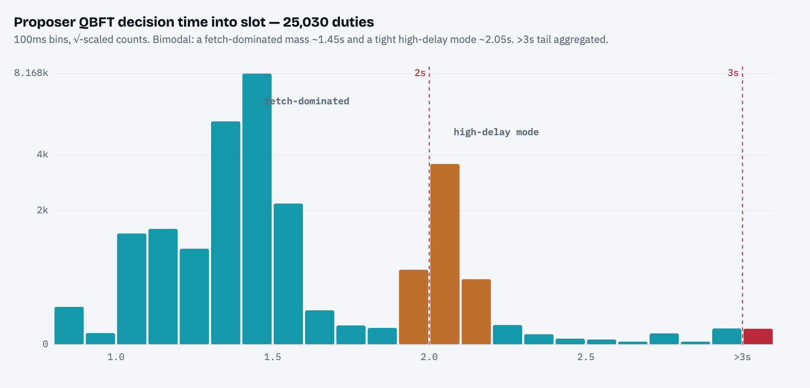
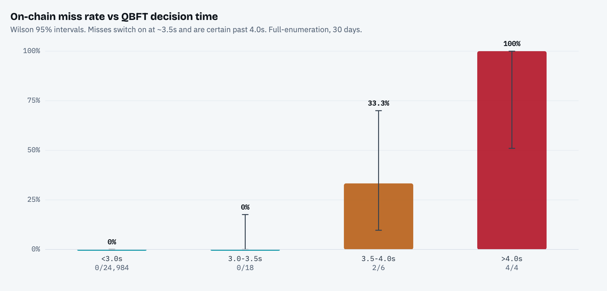
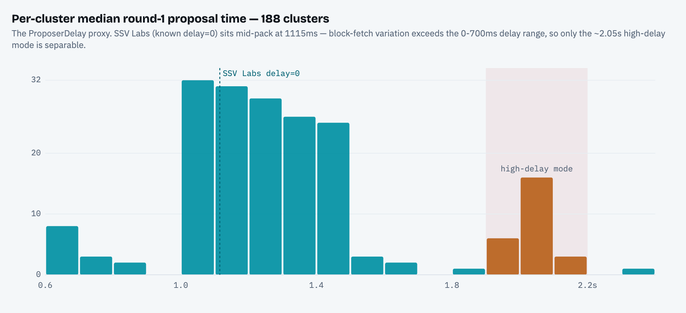
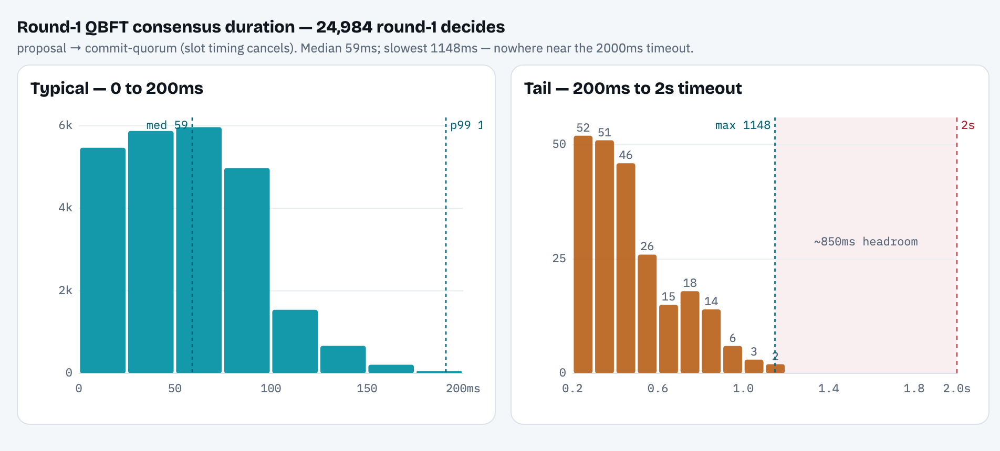

# Proposer QBFT Decision-Timing Analysis

Where proposer QBFT consensus decides within the slot, how that relates to on-chain block outcomes, and what (if anything) `ProposerDelay` has to do with it. Companion to the decision-timing work in [#2883](https://github.com/ssvlabs/ssv/pull/2883), scoped to the **proposer** duty and extended with full duty enumeration, a `ProposerDelay` inference, a round-1 consensus-duration study, and canonical-chain validation of every miss.

**Window:** 30 days of Ethereum **mainnet**, epochs `465250`–`472000`. **25,126** proposer duties, **99.6%** Exporter-trace coverage.

## TL;DR

- **Decision timing is bimodal:** a block-fetch–dominated mass at ~1.0–1.6s and a tight `ProposerDelay` mode at ~2.05s. Even SSV Labs' own `delay=0` nodes decide at ~1.15s — block fetch, not delay, sets the floor.
- **Deciding after 3s is rare (0.11%) and is almost always a round change:** 27 of 28 late decides are round 2. Round 2 is rare (0.17% of duties) but its **miss rate is 14.3%** vs **0.008%** for round 1.
- **The 4s cliff is real:** of 14 total missed proposals (0.056%), 6 decided late (>3s); the miss rate switches on at ~3.5s and is certain past 4.0s (0/24,984 ≤3.0s → 33% at 3.5–4.0s → 100% >4.0s). Those 6 late-decided misses were all **confirmed empty slots on the canonical chain**.
- **`ProposerDelay`, as deployed, is not the danger.** Clusters running ≥1000ms delay (296 duties) decided at ~2.15s with **zero round changes and zero misses** — the proposer round-1 timer runs from *consensus start*, not slot start, so delay doesn't shrink the round-1 budget. Late decides and misses track a few **chronic clusters** (operator health), not delay.
- **Round 1, when it succeeds, is fast:** median **59ms**, p99 191ms, max **1148ms** — a ~850ms dead zone separates the slowest success from the 2000ms timeout.

## Interactive reports

Two self-contained HTML pages (open via [htmlpreview.github.io](https://htmlpreview.github.io/) by pasting the file's GitHub URL, or download and open locally):

- [`qbft-decision-timing.html`](./qbft-decision-timing.html) — the full decision-timing / round / `ProposerDelay` analysis.
- [`late-qbft-decides.html`](./late-qbft-decides.html) — late-decide concentration by cluster (>2500ms & >3000ms), chain-verified misses, and the round-1 duration distribution.

## Data & method

**Sources.** (1) E2M `/api/duties` — every proposer duty in the window with its committee (operator set), on-chain `Success`, and MEV reward. (2) Exporter validator traces — per-round proposal / prepare / commit / round-change and the `decideds` aggregated-commit ("decided") messages, network-wide (covers external clusters, not just SSV Labs). (3) A public mainnet beacon node — canonical-chain validation.

**Decision time** is the Exporter's receive-time of the aggregated *decided* message — a single commit carrying a quorum (≥2f+1) of signers, which an operator broadcasts once it has reached commit quorum locally — minus slot start (`genesis + slot·12s`). It is *not* the Exporter accumulating individual commits; it trails the operators' own decision by the decided broadcast + one gossip hop, so true decisions are a touch earlier. The three layers — QBFT timing, on-chain outcome, and the derived delay estimate — are kept strictly separate per duty.

**Coverage & scale.** 25,126 duties; 99.63% had an Exporter trace. Exporter requests are compute-bound (~O(indices × slot-span), ~20s server ceiling), so collection batches adaptively and bisects on disconnect (see [`scripts/collect.py`](./scripts/collect.py)).

## 1. When QBFT decides



The distribution is **bimodal**. The large teal mass (peak ~1.45s) is dominated by MEV **block fetch**: `ProposerDelay` sleeps until `slotStart + delay`, *then* the leader fetches the block and starts consensus, and on SSV Labs' operators (ground truth `proposer_delay=0s`) the fetch alone took ~1.13s. So observed lateness ≈ `ProposerDelay + block_fetch`, and fetch is the larger term. The tight amber mode at ~2.05s is the clusters running a real `ProposerDelay`.

## 2. Late decides and the 4-second cliff

Deciding after 3s is rare and is almost entirely a round change — round 1 essentially never survives past ~3s:

| decision band | round 1 | round 2 |
|---|---:|---:|
| < 2.0s | 20,816 | 0 |
| 2.0–3.0s | 4,171 | 15 |
| 3.0–3.5s | 0 | 18 |
| 3.5–4.0s | 1 | 5 |
| > 4.0s | 0 | 4 |

Round 2 is rare but where blocks die:

| decided round | on-chain miss rate |
|---|---|
| round 1 | 0.008% (2 / 24,988) |
| round 2 | **14.3%** (6 / 42) |
| no consensus | 100% (3 / 3) |

<sub>11 of the 14 total misses are classified by round here; the other 3 had no Exporter trace.</sub>

And the miss rate as a function of decision time reproduces #2883's independent finding — safe below ~3.5s, a knife-edge to 4.0s, certain beyond:



### Concentration by cluster

Late decides are moderately concentrated (15 of 192 active clusters at >3000ms), with a thin network-wide background of otherwise-healthy clusters each hitting one round change, plus a couple of outliers. Misses are *highly* concentrated — one chronic cluster owns most of them. Operator sets shown are public on-chain SSV operator IDs.

**Decide > 3000ms (28 duties, 15 clusters):**

| cluster (operator set) | late | missed | duties/mo | late-rate | pattern |
|---|---:|---:|---:|---:|---|
| `2143, 2144, 2145, 2146` | 7 | 0 | 485 | 1.4% | round-changer (lands) |
| `491, 770, 1002, 1003` | 4 | **4** | 24 | **16.7%** | chronic misser |
| `6, 13, 16, 20` | 2 | 0 | 2 | — * | small (noise) |
| `2119, 2120, 2121, 2122` | 2 | 1 | 1,450 | 0.1% | background |
| `1716, 1717, 1718, 1719` | 2 | 0 | 1,597 | 0.1% | background |
| `80, 425, 688, 737` | 2 | 0 | 139 | 1.4% | background |
| + 9 more clusters | 1 each | 0 | — | — | one-off |

**Decide > 2500ms (48 duties, 19 clusters)** — doubles the population but adds **zero** new misses; the extra 20 are largely a *second* chronic round-changer (`1150…`) landing just under 3s:

| cluster (operator set) | late | missed | duties/mo | late-rate | pattern |
|---|---:|---:|---:|---:|---|
| `1150, 1151, 1152, 1153` | 14 | 0 | 64 | 21.9% | round-changer (lands) |
| `2143, 2144, 2145, 2146` | 7 | 0 | 485 | 1.4% | round-changer (lands) |
| `491, 770, 1002, 1003` | 4 | **4** | 24 | **16.7%** | chronic misser |
| `2119, 2120, 2121, 2122` | 3 | 1 | 1,450 | 0.2% | background |
| `1716, 1717, 1718, 1719` | 3 | 0 | 1,597 | 0.2% | background |
| `419, 420, 692, 694` | 2 | 1 | 38 | 5.3% | background |
| `6, 13, 16, 20` | 2 | 0 | 2 | — * | small (noise) |
| `80, 425, 688, 737` | 2 | 0 | 139 | 1.4% | background |
| + 11 more clusters | 1 each | 0 | — | — | one-off |

<sub>* late-rate is meaningless for clusters with only 1–3 proposals in the window.</sub>

## 3. `ProposerDelay` — can it be read off the wire?

There is no direct record of a cluster's `ProposerDelay` (see [`docs/MEV_CONSIDERATIONS.md`](../../MEV_CONSIDERATIONS.md) for the config), so we estimate it from each cluster's round-1 proposal timing. The catch:



Block fetch itself varies **more** than the delay we're hunting: SSV Labs (`delay=0`) medians 1115ms while the fastest clusters (likely local block building) median ~700ms — a ~375ms between-cluster spread, wider than a 400ms bucket. And `took` (block-fetch duration) is an internal node log, not on the wire, so it can be measured only for SSV Labs' operators. **Consequence:** low- vs mid-delay is not separable; only a coarse split survives — `≲700 / 700–1000 / 1000+` ms (baseline-subtracted, SSV-Labs-calibrated). Fine buckets flip with the baseline choice; ~13 of 103 reliable clusters are robustly ≥700ms.

**Reading the result correctly** — conditioning on the late decides (`share of late by bucket`) is base-rate biased; the useful metric is `P(late | bucket)`:

| ProposerDelay bucket | duties | decide > 3s | round-change | miss |
|---|---:|---:|---:|---:|
| ≲700ms | 20,064 | 0.10% | 0.17% | 0.030% |
| 700–1000ms | 4,477 | 0.07% | 0.04% | 0.045% |
| **1000ms+** | 296 | **0%** | **0%** | **0%** |
| small cluster (n<8) | 193 | 2.59% | 3.63% | 0% |

The ≥1000ms bucket (2 clusters, `1215–1218` and `1232–1235`) decided at a tight ~2.15s (max **2246ms**), with **0 round changes and 0 misses in 296 duties**. This is expected, not luck: the proposer round-1 timer is relative to **QBFT instance start, not slot start** ([`protocol/v2/qbft/roundtimer/timer.go`](../../../protocol/v2/qbft/roundtimer/timer.go)), so `ProposerDelay` does not shrink the round-1 budget — it shifts the (still round-1) decision later without giving the network any extra reason to round-change. The danger-zone population and the misses are driven by **round changes in a few chronic clusters**, not by delay.

## 4. Round-1 consensus duration

Measured as `decided − round-1 proposal` (slot timing cancels), for the 24,984 round-1 decides:



Round 1 finishes fast or not at all: median **59ms**, p99 **191ms**, and the slowest success in 30 days was **1148ms**. Nothing lands in the final ~850ms before the 2000ms timeout — past ~1.1s a stalled round times out into round 2 rather than "just barely" recovering. Only 5 duties (0.02%) exceeded 1s.

## Chain validation

Miss/success come from E2M; late blocks are exactly where a reorg could mislabel them. The 6 late-decided (round-2, >3s) misses were each checked against a public mainnet beacon node (`GET /eth/v1/beacon/headers/{slot}`): **all 6 are empty slots** on the finalized chain — no false positives, no reorg mislabeling — and four late-but-successful controls were confirmed canonical by the assigned proposer. [`scripts/chain_validate.py`](./scripts/chain_validate.py) validates all 14 flagged misses.

## Caveats

- **Exporter vantage.** Decision time is the receive-time of the aggregated *decided* message, so it trails the operators' own decision (decided broadcast + one gossip hop); near the 4.0s cliff this can nudge a duty across the line. The round-1 duration tail (what matters there) is well clear of that resolution.
- **`ProposerDelay` is not separable at fine granularity.** Absolute delay conflates with block-fetch/source latency; treat the buckets as observed-lateness tiers, and only the ≥~700ms tiers as meaningful.
- **Small tail counts.** 28 late decides, 42 round-2 duties, 14 misses in 30 days — per-bucket differences sit inside overlapping Wilson intervals; this shows `ProposerDelay` gives *no sign* of raising risk, not proof of immunity. Two high-delay clusters are also likely well-run (selection effect).
- **`ProposerDelay` affects proposer duties only.**

## Reproduce

```
# 1. collect (needs an ssv-scout workspace + Teleport vnet for Exporter/E2M)
SSV_SCOUT_DIR=/path/to/ssv-scout OUT_DIR=./data python scripts/collect.py 465250 472000
# 2. analyze
python scripts/analyze.py ./data/duties.jsonl
# 3. validate misses against canonical chain (public beacon API, no auth)
python scripts/chain_validate.py ./data/duties.jsonl
```

The ~13MB `duties.jsonl` is not committed; regenerate it with step 1.
