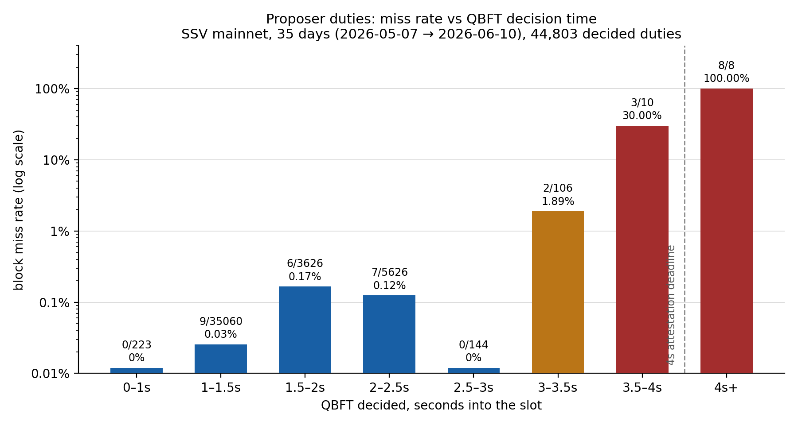

# Proposer QBFT decision timing vs block acceptance

*June 2026 — SSV mainnet, 35 days of data (2026-05-07 → 2026-06-10), 44,838 proposer duties across the whole network.*

This analysis measures the relationship between **when the proposer-duty QBFT instance decides** (seconds into the slot) and **whether the produced block is accepted by the Ethereum mainnet chain**. The motivating questions:

1. What share of proposer-duty QBFT instances reach round 2?
2. What share decide in round 2?
3. How does the block miss rate change as the QBFT decision time moves toward the 4s into-the-slot mark (the attestation deadline)?

## TL;DR

Round 2 is rare (~0.3% of proposer QBFTs), but deciding there is dangerous: **11.4%** of round-2 decisions resulted in a missed block vs **0.049%** for round-1 decisions — a ~230× relative risk. The dominant variable is not the round number, though; it is **wall-clock decision time relative to the 4s attestation deadline**:

- decided ≤ 3.0s into the slot → ~0.05% missed (background rate, unrelated to timing)
- decided 3.0–3.5s → ~1.9% missed
- decided 3.5–4.0s → 30% missed
- decided ≥ 4.0s → **100% missed (8/8)** — by then attesters have voted for the parent block, so the late block loses the fork-choice race essentially without exception

A round-2 decision that still lands by ~3.5s is almost always fine (2/96 missed). Past the 4s mark the block is effectively guaranteed to be rejected regardless of round.

## Headline numbers

| Question | Result |
|---|---|
| Proposer QBFTs that touched round ≥2 | 129 of 44,808 traced duties = **0.29%** — 115 of those (0.26%) progressed to a round-2 proposal or decision; the remaining 14 only had round-change messages observed |
| Decided in round 2 | 114 of 44,803 decided duties = **0.25%** (no round-3+ decisions occurred in 35 days) |
| Round-2 decision → block accepted | 101 / 114 = **88.6%** (missed 13 = 11.4%, CI95 [6.8%, 18.5%]) |
| Round-1 decision → block accepted | 44,667 / 44,689 = **99.951%** (missed 22 = 0.049%, CI95 [0.03%, 0.07%]) |
| Overall miss rate (canonical-chain-verified) | 41 / 44,838 = **0.091%** |

Decision-time distribution across all decided duties: p50 = 1.40s, p90 = 2.07s, p99 = 2.25s, p99.9 = 3.36s, max = 4.94s into the slot. Round-2 decisions cluster at 3.0–3.5s, which follows from the proposer round-1 timeout being 2s **from QBFT instance start** rather than from slot start ([#2429](https://github.com/ssvlabs/ssv/issues/2429)) — the instance itself starts only after RANDAO pre-consensus and payload fetch (~1.2s median).

### Within round-2 decisions only

| Decided at | n | missed | miss rate |
|---|---|---|---|
| < 3.0s | 7 | 0 | 0% |
| 3.0–3.5s | 89 | 2 | 2.25% |
| 3.5–4.0s | 10 | 3 | 30% |
| ≥ 4.0s | 8 | 8 | 100% |

Round 2 per se is survivable — *late* round 2 is not.

## What the misses actually are (41 total)

| Category | n | Notes |
|---|---|---|
| Decided round 2, late | 13 | Decided 3.37–4.94s into the slot; these are the timing-driven misses |
| Decided round 1, on time | 22 | Decided 1.10–2.44s; 21 of 22 also reached post-consensus quorum within ~2.5s, i.e. the block was signed and submitted promptly but never became canonical — relay / payload / submission / orphaning failures downstream of consensus |
| QBFT never decided | 5 | Consensus failure, no block produced at all |
| No trace observed | 1 | |

Seven committees account for 16 of the 41 misses — repeat offenders point at operator-specific infrastructure issues rather than random timing bad luck. Notably, the on-time round-1 misses are a *different failure class* from the timing cliff: deciding early does not protect against a failing relay or beacon submission path.

## Method

- **Duty enumeration and acceptance status**: SSV Labs' internal duty monitor (e2m), which tracks every assigned duty network-wide — including missed proposals, which the canonical chain alone cannot attribute to a proposer.
- **QBFT rounds and timing**: the exporter's duty traces (`/v1/exporter/traces/validator`). The exporter passively observes all P2P traffic, so coverage spans all operators, not only SSV Labs nodes. Trace coverage was 44,808 / 44,838 = 99.93%.
- **Acceptance ground truth**: every miss reported by the monitor was cross-checked against the canonical chain via a public beacon API (`/eth/v1/beacon/headers/{slot}`). One false miss was found (a monitoring ingestion gap) and corrected. "Missed" therefore means *no canonical block at the duty slot* — orphaned blocks count as missed.
- **Decision time** (`t_decided`) = arrival time of the earliest decided-quorum message at the exporter, minus slot start. Exporter timestamps are arrival times, so P2P propagation (typically well under ~300ms) shifts measurements slightly right; the same curve computed on post-consensus quorum time (the closest observable proxy to block broadcast) is identical in shape, shifted ~40ms.

### Caveats

- The round-1 vs round-2 comparison is correlational: whatever broke round 1 (a slow relay, a slow leader) may independently raise miss odds. The time-bucketed curves are the cleaner read, and both show the deadline effect dominating.
- The tail buckets are small (n=10 at 3.5–4.0s, n=8 at ≥4.0s), so the exact rates there carry wide confidence intervals — but the 0% → 30% → 100% gradient is unambiguous.

## Implications

- **`ProposerDelay` tuning** (see [MEV considerations](../../MEV_CONSIDERATIONS.md)): the delay inserts itself before QBFT starts, shifting the whole decision-time distribution right. With the current p50 ≈ 1.4s and p99 ≈ 2.25s, the data supports the existing guidance that ~1.2s is the upper bound of reasonable on mainnet: it keeps p99 decisions under the ~3s knee where the miss rate is still at background level. Values pushing decisions past ~3s buy MEV at a steep and sharply nonlinear cost.
- **Round changes are an early-warning signal, not a death sentence**: a round-2 decision still lands reliably if it completes by ~3.5s. Efforts to shorten the path to a round-2 decision (leader fail-over speed, payload re-fetch) have measurable value; efforts to salvage duties past 4s do not.

## Reproduction

The pipeline lives in the internal `ssv-scout` repository under `analysis/proposer-qbft-timing/` (see its README for the full runbook). Four steps, all parameterized by an epoch window and resumable after interruption:

1. **`fetch_duties.py`** — enumerate proposer duties with outcomes from the duty monitor: `GET /api/duties?types=propose&with_committee`, chunked 200 epochs/request (the server caps propose-only ranges at 14 days/request). Yields `{slot, validator, committee operator IDs, success}` per duty, including missed ones.
2. **`fetch_traces.py`** — exporter QBFT traces: `POST /v1/exporter/traces/validator` with `roles=["PROPOSER"]`, one request per 5-epoch batch carrying that batch's proposer indices (~15 min for 35 days).
3. **`analyze.py`** — joins and metrics. Every monitor-reported miss is re-verified against the canonical chain (`GET /eth/v1/beacon/headers/{slot}` on a public node; 404 = no canonical block = real miss), which also neutralizes the monitor's known block-ingestion false-negative mode. Time buckets `[0, 1, 1.5, 2, 2.5, 3, 3.5, 4, 4.5, 5, 6, 8, 12]`s with Wilson 95% CIs.
4. **`render_chart.py`** — the figure above, regenerated from the analysis output.

Key definitions: `t_decided` = earliest decided-quorum message arrival at the exporter minus slot start (genesis 1606824023 + slot × 12s); decided round = lowest round with a decided aggregate; post-consensus quorum = arrival of the (2f+1)-th distinct operator's partial signature, with quorum = n − (n−1)//3 for an n-operator committee.

Constraints to respect when re-running: exporter trace retention bounds the window (~5 weeks at the time of writing — probe an old slot first); end the window an hour or more before the present so duty outcomes are settled.

## See also

[Committee-duty QBFT decision timing vs attestation outcomes](../attester/README.md) — the attestation companion to this analysis, with the opposite conclusion: attestation inclusion is insensitive to decision time, and failures are binary and cluster-concentrated.
