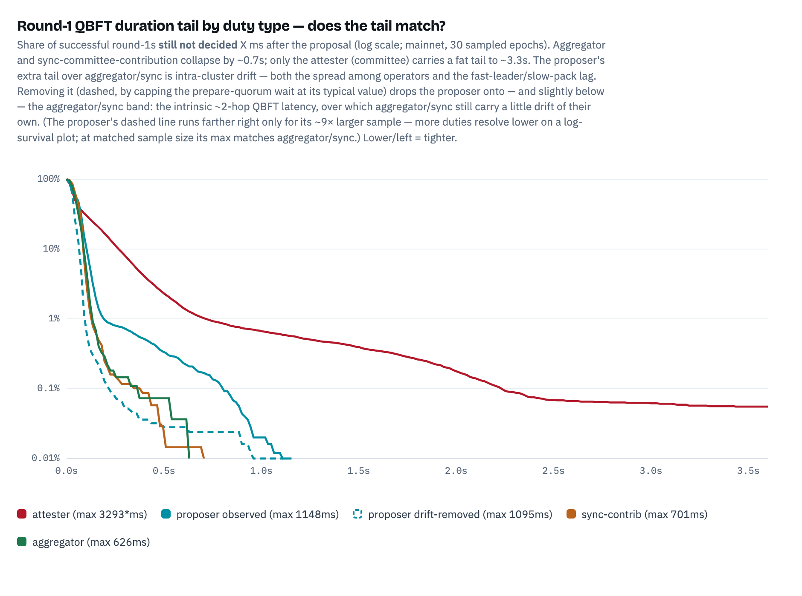

# Round-1 QBFT Duration Across Duty Types

How long round-1 QBFT consensus takes — from the leader's proposal to the decided message — for all four SSV duty types, and how much of the proposer's tail is intra-cluster drift. Extends the [proposer](../proposer-decision-timing/README.md), [attester](../attester-decision-timing/README.md), and [operator-drift](../operator-qbft-start-drift/README.md) analyses.

**Window:** Ethereum **mainnet**, epochs `465250`–`472000`, 30 sampled epochs. Proposer 24,984 duties; aggregator 2,746; sync-contribution 6,897; attester 110,244.

## TL;DR

- **Round-1 *duration* is tight for proposer, aggregator, and sync-contribution; only the attester has a fat tail.** Aggregator (max **626ms**) and sync-contribution (max **701ms**) hug the proposer's curve — in fact a touch tighter — while the attester trails to ~**3.3s**.
- **That difference is structural, not incidental.** The committee (attester) runner is the only one where each operator validates the proposal against its *own* node-derived vote and does so on the *currently-arriving* head; proposer/aggregator/sync validate a self-contained value (structural-only check) built on *settled* data, so operator readiness clusters tightly.
- **The proposer's *extra* tail over aggregator/sync is intra-cluster drift, and it separates cleanly.** The Exporter records per-operator prepare times, so removing the prepare-phase drift (both the spread among operators and the fast-leader/slow-pack lag) drops the proposer to **p99 92ms / p99.9 212ms** — at or below aggregator/sync, revealing the intrinsic ~2-hop QBFT latency all four share (aggregator/sync sit a little above it, still carrying their own small drift).

## The comparison



Round-1 duration = decided − round-1 proposal (Exporter receive-times), for round-1-decided duties:

| duty type | n | p50 | p90 | p99 | p99.9 | max |
|---|--:|--:|--:|--:|--:|--:|
| proposer (observed) | 24,984 | 59 | 102 | 191 | 796 | 1,148 |
| **proposer (drift-removed)** | 24,984 | 34 | 67 | **92** | 212 | 1,095 |
| aggregator | 2,746 | 47 | 89 | 128 | 335 | 626 |
| sync-contribution | 6,897 | 55 | 86 | 127 | 344 | 701 |
| attester (committee) | 110,244 | 44 | 267 | **712** | 2,231 | 4,010* |

\* attester's genuine max is ~3,293ms; the raw 4,010ms is the epoch-boundary Exporter artifact documented in the [attester analysis](../attester-decision-timing/README.md).

The medians are all ~50ms — a healthy round-1 is a couple of gossip hops regardless of duty. The divergence is entirely in the tail.

## Why aggregator/sync match the proposer, not the attester

Two things drove the attester's fat tail, and **both are absent** for proposer, aggregator, and sync-contribution:

- **Value-check semantics.** The committee runner validates the proposed `BeaconVote` by comparing its source/target epochs against the operator's *own* node-derived vote ([`value_check.go`](../../../protocol/v2/ssv/value_check.go), `voteChecker`), so an operator can only participate once its beacon node has determined the head. Proposer, aggregator, and sync-contribution all use *structural-only* checks (`proposerChecker` / `aggregatorChecker` / `syncCommitteeContributionChecker`) — a non-leader accepts the leader's self-contained value the moment it arrives.
- **Settled vs arriving data.** The committee attests to the *current* slot's head, which is still propagating (`round1HeadStart = slotDuration/3`, ~2.3s start). Proposer builds on the *settled* parent; aggregator and sync-contribution aggregate attestations / sync-messages that arrived at 4s and are pulled at ~8s (`round1HeadStart = slotDuration/3*2`, [`timer.go`](../../../protocol/v2/qbft/roundtimer/timer.go)). Waiting on an arriving block is inherently more variable than building on settled data.

So aggregator/sync decide *late* (~8.1s into slot, vs proposer's ~1.4s and attester's ~2.4s), but *how long consensus takes* once proposed is tight. Round changes are correspondingly low: aggregator 0.18% (≈ proposer's 0.17%), sync-contribution 0.82%, vs attester 1.09%.

## Isolating the drift

The proposer's tail lives in the **prepare phase**: in its slowest round-1s the prepare spread is ~1,145ms while the commit spread is only ~18ms — the leader prepares immediately, the quorum waits ~1s for its marginal operator, and commits fire fast once 2f+1 prepares exist. That wait carries two forms of drift, both measured from the leader's proposal:

- **Spread among the responding operators** — the marginal operator lags the fastest responder.
- **Fast leader, slow pack** — the dominant one in the extreme tail. There the leader proposed *early* (median 632ms into slot, vs 1,355ms typical) because it got its block fast, while the *whole* cluster was still block-fetching, so even the quickest non-leader prepared ~426ms later (vs a normal ~9ms hop). A proposer non-leader can only prepare once its *own* block-fetch completes ([`proposer.go`](../../../protocol/v2/ssv/runner/proposer.go), it enters consensus after fetching) — even though it doesn't need that block to validate the leader's proposal. Aggregator/sync avoid this: they aggregate a light, already-settled value at ~8s, so the cluster is ready together. This is the [full operator-start spread](../operator-qbft-start-drift/README.md) surfacing in the duration.

Capping the whole prepare-quorum wait (proposal → 2f+1-th prepare) at its typical drift-free value (Q ≈ **19ms**) removes both: `drift-removed = observed − max(prepare-quorum wait − Q, 0)`. Well-synced duties are unchanged; drift duties shed only the excess wait. It drops the proposer to **p99 92ms, p99.9 212ms** (dashed line) — at or below aggregator/sync, since those retain their own small drift. All four converge on the intrinsic ~2-hop QBFT latency, exactly as expected.

## Method & caveats

- **Duration is Exporter receive-times** of the round-1 proposal and the aggregated decided message; the decided is gated by the marginal (2f+1-th) operator to reach quorum.
- **The drift-removed proposer's extreme max (1,095ms) is sample size, not a real cost.** At fixed percentiles it is already tighter than aggregator/sync (p99.9 **212ms** vs 335/344ms); the longer visible max is only because the proposer has ~9× more duties (24,984 vs 2,746/6,897), so on the log-survival plot its curve resolves farther down before its last sample. Subsampled to the aggregator's N, the drift-removed proposer's max is ~**493ms** median [239–1,053] — comparable to, and below, the aggregator's 626ms. And the 13 duties past 300ms all show the prepare quorum forming instantly yet the *decided* stamped 0.3–1.1s later with commits bunched at a single instant (spread ≈ 0) — the signature of Exporter receive-time noise on the decided message (sporadic, across 13 different epochs), not a real commit phase.
- **The removal is conservative.** `Q` is the population-median prepare-quorum wait; capping the wait at a fixed drift-free value leaves well-synced duties untouched.
- **Aggregator is sampled** across the validator population (~3–4% are selected per duty); sync-contribution is targeted at each epoch's sync-committee validators. Both are per-validator duties, unlike the committee-level attester.

## Reproduce

```
# aggregator + sync-contribution round-1 timing (needs an ssv-scout workspace + vnet)
cd scripts
SSV_SCOUT_DIR=/path/to/ssv-scout OUT_DIR=./data python collect.py 465250 472000
# drift-removed proposer duration (reuses the proposer analysis raw traces)
PROP_DATA=../../proposer-decision-timing/scripts/data python drift.py
# comparison table + chart (reuses proposer + attester datasets)
python compare.py
```
