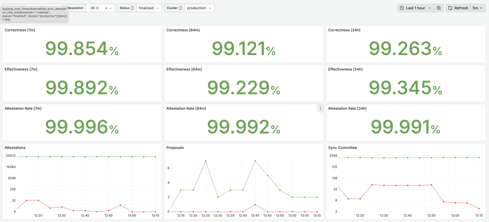
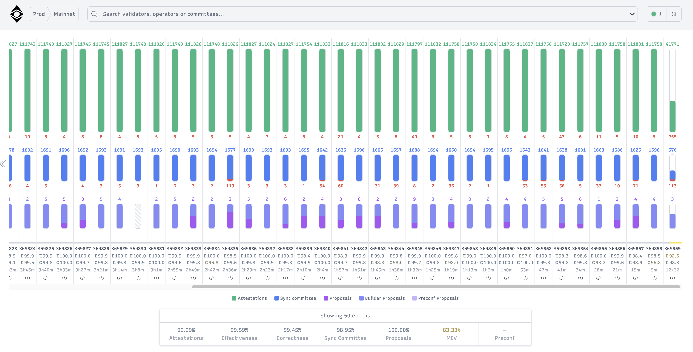
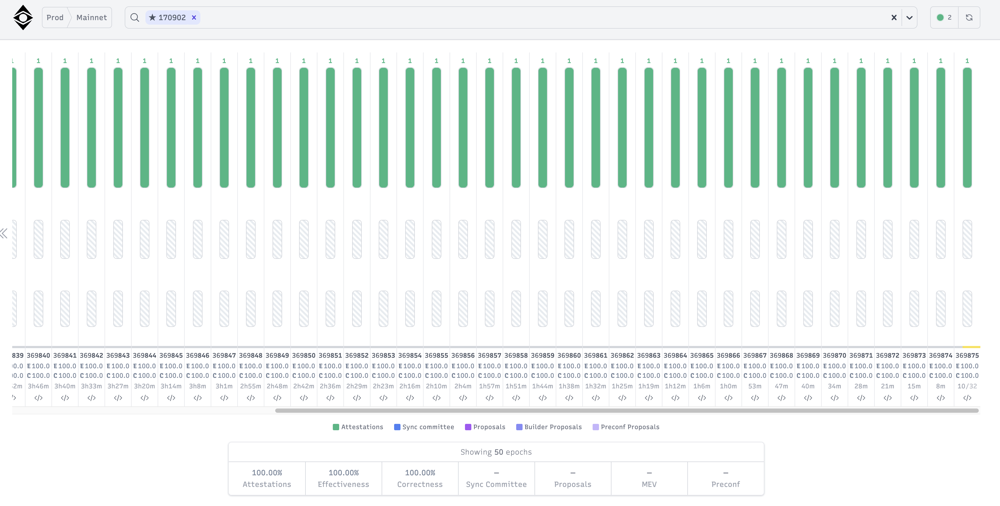
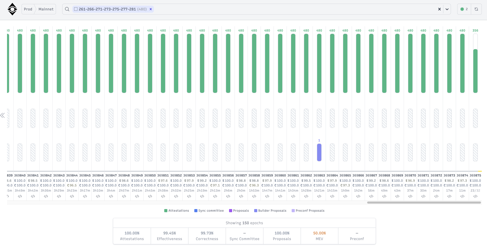
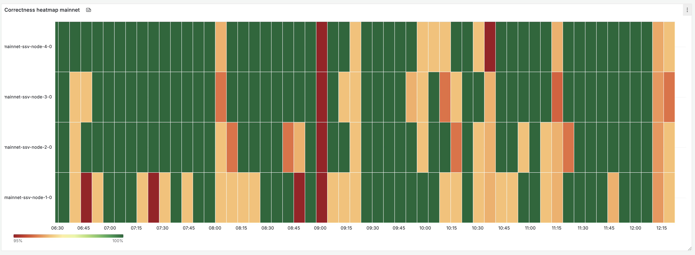

# Overview

Attestation in Ethereum is the process through which Validators confirm the accuracy of the blockchain's current state by voting and reaching a consensus, thereby ensuring the security and integrity of the chain.

Every epoch (6.4 minutes), a Validator proposes an attestation to the network. The attestation is for a specific slot (every 12 seconds) in the epoch and it votes in favor of the Validator's view of the chain. Although committee and slot assignments for attesting are randomized, every active Validator will be selected to make exactly one attestation each epoch.

Honest nodes have `1/3 * SECONDS_PER_SLOT` (4 seconds) from the start of the slot to either receive the block or decide there was no block produced and attest to an “empty/skipped” slot. Once this time has elapsed, attesters should broadcast their attestation reflecting their local view of the chain.

Full technical specification for Ethereum attestations can be found [here](https://github.com/ethereum/consensus-specs/blob/dev/specs/phase0/validator.md#attesting).

We've published a high-level overview of how SSV network executes Ethereum validator duties (Validator is distributed across cluster of Operators) [in the past](https://ssv.network/blog/technology/ssv-protocol-implementation-deep-dive/), the high-level summary for validator-attestations specifically (with optimizations [Alan-fork brought forth](https://ssv.network/blog/technology/the-impact-of-alan-on-mainnet-post-fork-analysis/)) looks like this:
- every Operator (SSV node) polls its own Beacon node periodically to fetch all the necessary validator-attestation duties for the upcoming slots, many validator-attestation duties are clustered together (Validator is always assigned to some Operator-cluster)
- when the next Ethereum slot time comes, every Operator checks if there are validator-attestation duties to perform for any Operator-cluster he is part of, and if there are - Operator kicks off duty execution for that particular Operator-cluster (which is comprised of a bunch of attestation duties for specific Validators for that target slot); every Operator in SSV cluster does the same thing independently - this way Operator-cluster as a whole can function in face of some Operators in Operator-cluster misbehaving (due to being maliscious or simply experiencing issues such as downtime)
- once validator-attestation duty is started, Operator waits 4 seconds (1/3 of Ethereum slot-time) to make sure enough time passes for block production to happen for the current(target) slot such that voting validator can actually see the latest produced block and vote on it
- slashing protection mechanism kicks in to ensure Operator never signs two contradicting attestations (Ethereum can slash validator collateral for that)
- if everything goes smoothly so far, Operator starts / joins QBFT consensus protocol that every Operator in Operator-cluster needs to undergo to "agree on what Ethereum attestations will be signed" (this should succeed as long as 2/3 of Operators in the Operator-cluster are honest and available)
- once the QBFT consensus has been reached every Operator ends up with his own "local copy" of the signed attestations which Operator sends via his own Beacon node to Ethereum network, and at this point Operator is done with validator-attestation duty for the target slot
- later on attestation results will be aggregated & included in the upcoming Ethereum blocks by Ethereum network itself

# Measuring validator-attestation performance

Around 85% of validators' rewards come from making attestations (see the [Attestation rewards section](https://besu.hyperledger.org/public-networks/concepts/proof-of-stake/attestations#attestation-rewards) for more details). Validator rewards in Ethereum can be negatively affected by multiple factors such as: poor network connectivity, network latency, slow hardware, software bugs, etc. Most Ethereum client implementations (including SSV node) print logs that Operator can use to debug a particular issue, but to get a bird's-eye view it's better to look at metrics that can be "charted over time" such that any changes in client-node behavior can be easily spotted.

For Ethereum attestations specifically the most interesting metrics are **"success rate"**, **"correctness"**, **"effectiveness"**.

## success rate

Success rate defines how many attestations "validator actually produced" (meaning they were included into Ethereum chain) vs how many attestations this "validator was meant to produce" over some period of time (eg. 10 epochs):
```
// (validator actually produced) / (validator was meant to produce), in % terms
metrics.Rate(stats.Attestations.Executed, stats.Attestations.Assigned)
```

## correctness

Even if attestation was successfully accepted (acknowledged) by Ethereum network it doesn't necessarily mean it was attesting to the correct block. This is because different validators might see different versions of the tip of Ethereum chain - so they cast different attestation votes - with the "votes that agree with each other the most winning over time" (and receiving the highest rewards as the result). Thus, attestation correctness is defined as:
```
// (correct successful attestations) / (total successful attestations), in % terms
metrics.Rate(stats.CorrectHeadVotes, stats.Attestations.Executed)
```
Meaning, if attestation vote was cast relatively late it's less helpful to the Ethereum network, and as such the reward validator receives for it will be lower.

## effectiveness

Attestation effectiveness can be thought of as how useful a correct attestation is to the network, considering **when** it showed up on-chain with respect to the slot it attests to:
```
// (earliest inclusion slot - attestation slot) / (actual inclusion slot - attestation slot), in % terms
slotEffectiveness := (float64(duty.EarliestInclusionSlot-duty.Slot) / float64(duty.InclusionSlot-duty.Slot)) * 100
```

## SSV charts we use internally

To collect and display all the data involved we use leading-edge observability tools such as Open Telemetry, Prometheus and Grafana.

**"success rate"**, **"correctness"**, **"effectiveness"** can be viewed on per-validator level, but for general system-health monitoring it's useful to aggregate across all validators to get an overview on how SSV network is doing in general over some period of time (slot, epoch, 10 epochs, ...):





For a select validator it would look like:



The data displayed on the charts above is based on what actually happened with the Ethereum chain.

**"success rate"**, **"correctness"**, **"effectiveness"** can also be viewed through SSV-specific lens to answer a question of how a praticular Operator-Cluster is performing over some period of time (slot, epoch, 10 epochs, ...):



we can get an even more detailed breakdown on how a particular Operator is doing during each epoch:



# Summary

At SSV-labs we value data-based approach. To get the most out of DVT technology, we are constantly enhancing data gathering and analytics tools at our disposal to find and resolve the bottlenecks SSV Validators and Operators might experience, and Ethereum validator-attestations in just one example of how we do it.

# References
- https://docs.ethstaker.org/validator-clients/validator-effectiveness/?h=effect
- https://besu.hyperledger.org/public-networks/concepts/proof-of-stake/attestations
