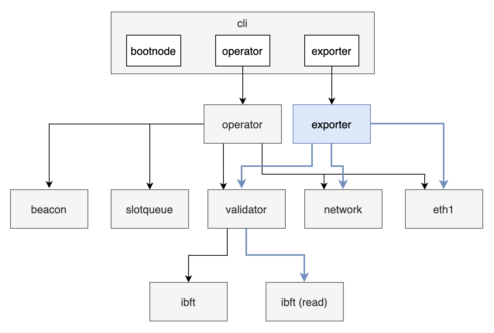

# Exporter Node

## Intro

Exporter node is responsible for exposing data from SSV Network to the Explorer Center, which index the data and provides an API for the Web UI.

The Web UI shows information for a validator,
It provides a way for validator to inspect the operators' performance, duties history and more.

### Links

* [BLOXSSV-157](https://bloxxx.atlassian.net/browse/BLOXSSV-157)

## Design

Exporter node is new type of peer that needs to pull and store data from SSV nodes or smart contract. \
As most of that logic already exist in SSV, the exporter is just a new executable, re-using existing code from SSV and have slightly different configuration.


The introduction of exporter requires to do some refactoring in the project structure as follows:



### Bootstrap

On start, exporter will first finish syncing data and only afterwards will start. \
Once sync is finished, the exporter is able to serve requests and listen to live events from the contract.

### Data

The following information will be needed:
* Operators 
  * Name --> contract event
  * Public Key --> contract event
  * Owner Address --> contract event
  * Index --> a sequential index
* Validators
  * Public Key --> contract event
  * Operators --> contract event
  * Index --> a sequential index
* Duties (over time) 
  * Epoch --> calculated from Slot
  * Slot --> part of the lambda
  * Duty type / role --> part of the lambda
  * Status (failed | success)
  * Operators --> signer_ids + id lookup in contract information (oess > index)
    * operators with the corresponding indication for each operator on the duty

#### Contract Data

Events to listen:
* `OperatorAdded`
* `ValidatorAdded`
* `OessAdded`

##### Sync

In order to have all the needed data, exporter needs to [read all events logs](https://goethereumbook.org/event-read/) 
of the specified events. 

[`FilterLogs()`](https://github.com/ethereum/go-ethereum/blob/master/ethclient/ethclient.go#L387) 
accepts [`FilterQuery`](https://github.com/ethereum/go-ethereum/blob/master/interfaces.go#L138) 
that enables to query a specific contract by addresses, and to provide a scope of blocks 
(`FromBlock`, `ToBlock`)

A genesis block for the contract can be used as a baseline block (the block to start the sync)

#### IBFT Data

Interaction with SSV nodes can be done using the existing sync end-point (`libp2p` stream)
  
### Persistency

A storage for Exporter Node should support persistence of:
* Operators
* Validators
* IBFT (decided)

#### Database

A Key-Value Store (e.g. Badger) is a good candidate because the Explorer Center does the indexing with ES. 

Badger is an embedded DB (stored in FS), therefore won't support HA. \
In order to achieve HA, one of the following should be the way to go:
* Use some other remote DB (e.g. S3)
* Use a shared volume (K8S)

### APIs

#### Explorer Center

Exporter Node provides a WebSocket endpoint for reading the collected data. \
The messages will support several use-cases:
* push data by exporter, will be triggered on live data
  * IBFT data - push once decided messages arrives
  * Operators / Validators - push on contract events
* request data by explorer
  * requested with the corresponding filters

##### Message Structure

Request holds a `filter` for making queries of specific data 
and a `type` to distinguish between messages:
```
{
  "type": "operator" | "validator" | "ibft"
  "filter": {
    "from": number,
    "to": number,
    "role": "ATTESTER" | "AGGREGATOR" | "PROPOSER",
    "pubKey": string
  }
}
```
Response extends the Request with a `data` section that contains the corresponding results:
```
{
  "data": Operator[] | Validator[] | DecidedMessage[]
}
```

##### Examples

Request:
```json
{
  "type": "operator",
  "filter": {
    "from": 0
  }
}
```
Response:
```json
{
  "type": "operator",
  "filter": {
    "from": 0
  },
  "data": [
    {
      "publicKey": "...",
      "name": "myOperator",
      "ownerAddress": "..."
    }
  ]
}
```