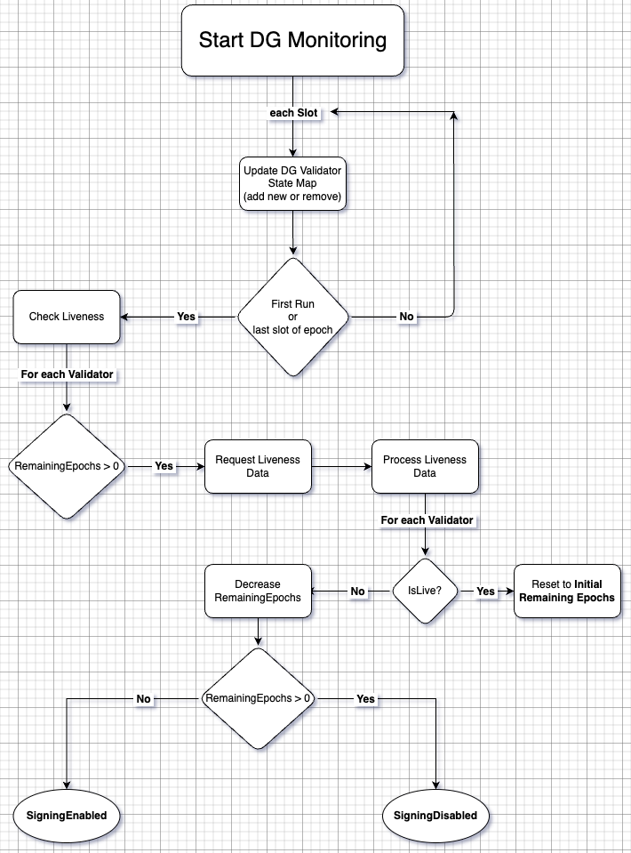

# Doppelganger Protection in `ssv.network`

## 0. Quickstart: Enabling Doppelganger Protection
Doppelganger (DG) protection is **disabled by default**.  
To enable it in your SSV node, set the following environment variable:
```bash
ENABLE_DOPPELGANGER_PROTECTION=true
```

or enable it in your `config.yaml` file: 
```yaml
EnableDoppelgangerProtection: true
```
⚠️ Teku Users:
To make Doppelganger protection work with Teku, you must also run your beacon node with:
```bash
--beacon-liveness-tracking-enabled=true
```
This flag is required for the SSV node to detect validator liveness via the Beacon Node.

### ✅ What to Expect After Enabling

 - The node will **wait ~3 epochs** to ensure each validator is not already active on the Ethereum network.
 - If **no activity is detected**, the validator is marked **safe to sign**.
 - Validators can also be marked safe **immediately** if a **post-consensus quorum** is reached by the validator's operator committee.

🔁 On **node restart**, Doppelganger protection is **reset**, and the safety check process starts again.


## 1. Introduction to Doppelganger Protection
Doppelganger (DG) protection is a security mechanism designed to **prevent a validator from accidentally running in two places at the same time.** This is critical in **Proof-of-Stake (PoS) networks** like Ethereum, where **double signing** can lead to **slashing penalties**.

### How Doppelganger Detection Works in Most Validator Clients (e.g., Lighthouse, Prysm)
Most validator clients, including **Lighthouse, Prysm, Teku, and Nimbus**, implement Doppelganger detection by:

1. **Checking validator activity**: The client queries the Ethereum network to check whether a validator has been recently active (i.e., seen in attestations network messages).
2. **If active, the client is terminated**: When a validator is found to be live elsewhere, **the client stops performing duties for all validators running on the same client**, preventing accidental slashing.
3. **If inactive, the validator temporarily disables signing**: The validator continues checking for activity until **a predefined number of epochs** pass without detection.

## 2. How is Doppelganger Protection Different in `ssv.network`?
In `ssv.network`, validators operate under a **distributed multi-operator model**, where **a committee of operators jointly signs** instead of a single validator client.
As a result, traditional Doppelganger detection methods used by solo staking clients need to be adapted to account for the distributed nature of signing.

### When is a Validator Marked as Safe in `ssv.network`?
A validator is **considered safe to sign** when:

1. **It has not been active on the Ethereum network for a predefined number of epochs**. If no recent attestations/proposals are found, the validator is **safe to sign**.
2. **Post-consensus quorum confirms validator safety**. If a validator participates in consensus and reaches the post-consensus step (i.e., a majority of operators in the validator’s committee agree via post-consensus partial messages quorum aka "decided"), then the validator can be marked as **safe** and start signing duties.
    - **Rationale**: This guarantees that the validator is **already actively running inside its `ssv.network` committee**, ensuring that the liveness status reported by the Beacon Node is likely due to its participation in `ssv.network` rather than another client.

## 3. Pros & Cons of `ssv.network` Doppelganger Protection

### 🏆 **How ssv.network Doppelganger Protection Differs from Solo Staking Clients**

| 🟢 **Pros (ssv.network DG)** | 🔴 **Cons (ssv.network DG)** | 🏛️ **Solo Staking Clients (Lighthouse, Prysm, Teku, etc.)** |
|-----------------------------|-----------------------------|------------------------------------------------|
| ✅ **Prevents slashing** by ensuring validators do not sign while potentially active elsewhere. | ⚠️ **Operators running beacon nodes must enable liveness tracking** for Doppelganger protection to function properly. Example: Teku requires `--beacon-liveness-tracking-enabled=true`. | ❌ **Terminates the entire validator client process** upon detecting a Doppelganger, preventing further duties for all validators on that node. |
| ⚡ **Minimizes validator downtime** by allowing a **post-consensus quorum** to determine safety, instead of waiting blindly for inactivity epochs. | 🏗️ **Higher state-tracking complexity** due to integration with post-consensus logic. | ⏳ **Disables signing for all validators** and waits for a predefined inactivity period. |
| 🤝 **Works in distributed staking setups** where multiple operators sign jointly. **Each validator is evaluated separately.** If the BN fails to report accurate liveness, the validator can still be marked safe via **post-consensus operator agreement.** | ⏳ **Potential delays** if the post-consensus quorum does not finalize in time. ⚙️ **Extra computational overhead**, as each validator's state must be tracked independently. | 📡 **Solo staking clients fully depend on BN-reported liveness**, which can be inaccurate due to network issues. A single **faulty BN report** can cause unnecessary downtime. |
| 🎯 **Granular control**: Instead of disabling all validators at once, **validators can be marked safe individually** when meeting safety criteria. | 🔍 **One or more operators failing to enable BN liveness tracking could affect accurate Doppelganger detection.** | ⚡ **One faulty BN report can lead to unnecessary downtime for all validators on the client.** |

# 4. Additional considerations
### 💰 Cost of Protection
- A validator will incur penalties due to 2-3 missed epochs during Doppelganger Protection.
- This trade-off is minor compared to the potential slashing penalties, making it an acceptable cost for securing validators.

### 🛑 Imperfect Nature of Doppelganger Protection
- Doppelganger detection relies on network communication and message propagation, which can fail under certain circumstances.
- The design must handle network latency and faults gracefully to avoid unintended validator downtime.


# 5. Doppelganger Life Cycle


- **Liveness Monitoring & State Tracking**
  The Doppelganger Monitoring Process is a crucial mechanism that runs every slot to keep the Doppelganger state map (doppelgangerState) up-to-date.
    1. The `handler` continuously monitors validators by running every slot.
    2. it queries the `ValidatorProvider` to fetch currently participating validators for the operator.
    3. The `Doppelganger` state map is updated accordingly.
    4. The map acts as the backbone for the DG protection mechanism, meaning
       If a validator is not found in the map, it is not safe to sign

- **Processing Liveness Data**
  Ensures that validators transition safely from a potentially unsafe state to a safe signing state.

- **Removes validators from the state when they are removed/liquidated:**
- **Prevents attestation/proposal signing** if Doppelganger check is pending
- **Marks validator as safe** after post-consensus partial messages quorum

# 6. Doppelganger Protection Log Guide

| 🏷️ **Event**                                            | 🔍 **Description** | 📜 **Example Log**                                                                                                                                            |
|----------------------------------------------------------|------------------|---------------------------------------------------------------------------------------------------------------------------------------------------------------|
| **🛡️ Doppelganger Protection Status**                   | Logs when **Doppelganger protection** is **enabled or disabled** at startup. | `[INFO] Doppelganger protection enabled.` / `[INFO] Doppelganger protection disabled.`                                                                        |
| **🟢 Doppelganger Monitoring Started**                   | Logs when the monitoring loop starts | `[INFO] Doppelganger monitoring started`                                                                                                                      |
| **🛠 Ticker Event**                                      | Logs epoch & slot position for tracking | `[DEBUG] 🛠 ticker event epoch_slot_pos="e114562-s3665985-#2"`                                                                                                |
| **🆕 Validators Added to State**                         | Logs when new validators are tracked | `[DEBUG] Added validators to Doppelganger state validator_indices=[123, 456, 789]`                                                                            |
| **🧹 Validators Removed from State**                    | Logs when validators are removed | `[DEBUG] Removed validators from Doppelganger state validator_indices=[123, 456, 789]`                                                                        |
| **🗑️ Validator Removed from State**                     | Logs when a validator is removed from Doppelganger state | `[DEBUG] Removed validator from Doppelganger state validator_index=123`                                                                                       | 
| **❓ Validator Not Found in Doppelganger State**          | Logs when a validator is expected but missing | `[WARN] Validator not found in Doppelganger state validator_index=123`                                                                                        |
| **🚫 No Validators for Liveness Check**                  | Logs when no validators need checking | `[DEBUG] No validators require liveness check`                                                                                                                |
| **⚠️ Failed Liveness Check**                             | Logs when Beacon Node fails to provide liveness data | `[ERROR] Failed to obtain validator liveness data error="beacon node request failed"`                                                                         |
| **🔎 Processing Liveness Data**                          | Logs when liveness check results are processed | `[DEBUG] Processing liveness data epoch=420 validator_index=123 is_live=true`                                                                                 |
| **🛑 Doppelganger Detected**                             | Logs when a validator is active elsewhere | `[WARN] Doppelganger detected live validator validator_index=123 epoch=4567`                                                                                  |
| **🟠 Validator Still Under Observation**                 | Logs when a validator is still under observation and requires more epochs to be marked safe. | `[DEBUG] Validator still requires further checks validator_index=123 remaining_epochs=1`                                                                      |
| **✅ Validator is Safe to Sign**                          | Logs when a validator is cleared to sign | `[DEBUG] Validator is now safe to sign validator_index=123`                                                                                                   |
| **✅ Post-Consensus Safe Confirmation**                   | Logs when post-consensus **marks a validator as safe** after quorum agreement. | `[DEBUG] Validator marked as safe validator_index=123`                                                                                                        |
| **⛔ Signing Blocked Due to DG Protection**               | Logs when a validator tries to sign but is not permitted due to Doppelganger protection | `[WARN] Signing not permitted due to Doppelganger protection validator_index=123`                                                                             |
| **⏭️ Skipping Message Broadcast**                        | Logs when all attester duties are blocked by Doppelganger protection and no sync committee duties exist | `[DEBUG] Skipping message broadcast: all attester duties blocked by Doppelganger protection, no sync committee duties. attester_duties=5 blocked_attesters=5` |
| **❌ Failed to Decrease Remaining Epochs**                | Logs when `decreaseRemainingEpochs` is called but the remaining epochs are already at 0 | `[ERROR] Failed to decrease remaining epochs error="attempted to decrease remaining epochs at 0`                                                              |
| **🛑 Epoch Skip Detected & Reset**                       | Logs when an unexpected epoch gap occurs and all doppelganger states are reset | `[WARN] Epoch skipped unexpectedly, resetting all Doppelganger states previous_epoch=123 current_epoch=125`                                                   |
| **🔄 All Doppelganger States Reset**                     | Logs when all validators' states are reset to initial detection epochs | `[INFO] All Doppelganger states reset to initial detection epochs`                                                                                            |


# 7. Summary & Final Thoughts
This implementation ensures **security, flexibility, and efficient liveness tracking** while **minimizing validator downtime**. Unlike traditional **solo validator clients**, `ssv.network` leverages **post-consensus quorum** to **safely mark validators as active**, reducing unnecessary waiting time.

This is a **significant enhancement** over traditional **Ethereum staking models** and provides **a secure, distributed mechanism for slashing prevention** while keeping validators online efficiently. 🚀
