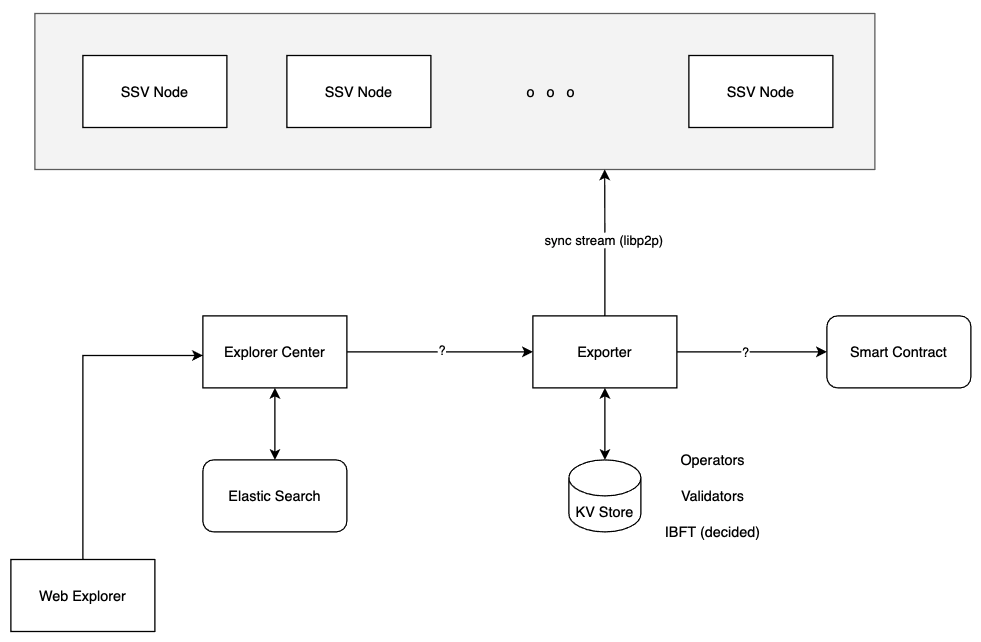

[](https://www.bloxstaking.com/)

<br>
<br>

# *TODO: This file contains old information and needs to be updated.*

# SSV - Exporter

## Intro

Exporter node is responsible for exposing data from SSV Network to the Explorer Center, which index the data and provides an API for the Web UI.

The Web UI shows information for a validator,
It provides a way for validator to inspect the operators' performance, duties history and more.

### Links

* [BLOXSSV-157](https://bloxxx.atlassian.net/browse/BLOXSSV-157)

## Design

Exporter node is new type of peer that needs to pull and store data from SSV nodes or smart contract. \
As most of that logic already exist in SSV, the exporter is just a new executable, re-using existing code from SSV and have slightly different configuration.




### Data Model

The following information will be stored and served by exporter:

#### Operators 

  ```json
  {
    "publicKey": "...",
    "name": "myOperator",
    "ownerAddress": "...",
    "index": 0
  }
  ```

#### Validators

  ```json
  {
    "publicKey": "...",
    "operators": [{ "publicKey": "...", "nodeId": 1 }],
    "index": 2341
  }
  ```

#### Decided Messages

  ```json
  {
    "message": {
      "type": 3,
      "round": 1,
      "lambda": "...",
      "seq_number": 23,
      "value": "..."
    },
    "signature": "...",
    "signer_ids": [2, 1, 3]
  }
  ```

### Data Sources

#### Contract Data

Events to listen:
* `OperatorRegistration`
* `ValidatorRegistration`

#### Contract Sync

In order to have all the needed data, exporter needs to [read all events logs](https://goethereumbook.org/event-read/) 
of the specified events.

On start, exporter will first finish syncing data. Once sync is finished, the exporter will be able to serve requests and listen to live events from the contract.

[`FilterLogs()`](https://github.com/ethereum/go-ethereum/blob/master/ethclient/ethclient.go#L387) 
accepts [`FilterQuery`](https://github.com/ethereum/go-ethereum/blob/master/interfaces.go#L138) 
that enables to query a specific contract by addresses, and to provide a scope of blocks 
(`FromBlock`, `ToBlock`)

A genesis block for the contract can be used as a baseline block (the block to start the sync)

#### IBFT Data

Interaction with SSV nodes can be done using the existing history sync end-point.
  
### Persistency

A storage for Exporter Node should support persistence of:
* Operators
* Validators
* IBFT (decided)

#### Database

A Key-Value Store (`Badger`) is a sufficient storage as the indexing of the data will be done by exporter consumers (Explorer). 

Badger is an embedded DB (stored in FS), therefore won't support HA. \
In order to achieve HA, one of the following should be the way to go:
* Use some other remote DB (e.g. S3)
* Use a shared volume (K8S)

### APIs

Exporter Node provides WebSocket endpoints for reading the collected data. \
There are 2 types of end-points:

- `stream` - exporter pushes live data
  - IBFT data - notify once decided messages arrives
  - Operators / Validators - notify on contract events
- `query` - consumer request data on demand
  - requested with the corresponding filters

#### Message Structure

Request holds a `filter` for making queries of specific data 
and a `type` to distinguish between messages:
```
{
  "type": "operator" | "validator" | "decided"
  "filter": {
    "from": number,
    "to": number,
    "role": "ATTESTER" | "AGGREGATOR" | "PROPOSER",
    "publicKey": string
  }
}
```

Response extends the Request with a `data` section that contains the corresponding results:
```
{
  "data": Operator[] | Validator[] | DecidedMessage[]
}
```

In addition, response might reflect an error, see [Error Handling](#error-handling):
```
{
  "type": "error",
  "data": string[]
}
```

#### End Points

##### Query

`/query` is an API that allows some consumer to request data, by specifying filter.

For example, a request to get all available operators:
```json
{
  "type": "operator",
  "filter": {
    "from": 0
  }
}
```
Exporter will produce the following response:
```json
{
  "type": "operator",
  "filter": {
    "from": 0
  },
  "data": [
    {
      "publicKey": "...",
      "name": "myOperator",
      "ownerAddress": "...",
      "index": 0
    },
    {
      "publicKey": "...",
      "name": "myOperator",
      "ownerAddress": "...",
      "index": 1
    },
    ...
  ]
}
```

###### Error Handling

In case of bad request or some internal error, the response will be of `type` "error".

Some examples:

- Bad input (corrupted JSON) produces:
  ```json
  {
    "type": "error",
    "filter": {
      "from": 0,
      "to": 0
    },
    "data": [
      "could not parse network message"
    ]
  }
  ```
- Unknown message type results:
  ```json
  {
    "type": "error",
    "filter": {
      "from": 0,
      "to": 0
    },
    "data": [
      "bad request - unknown message type 'foo'"
    ]
  }
  ```


##### Stream

`/stream` is an API that allows consumers to get live data that is collected by the exporter, which will push the information it receives (validator, operator or duties) from SSV nodes or contract. 

For example, exporter will push a message if a new validator was added to the network:
```json
{
  "type": "validator",
  "filter": {
    "from": 2430,
    "to": 2431,
  },
  "data": [
    {
      "publicKey": "...",
      "operators": [...],
      "index": 2341
    }
  ]
}
```

Besides new validators, it will also notify on new operators and decided messages.

## Usage

### Run Locally

Build if you don't have the executable:
```shell
make build
```

Then run with:
```shell
make CONFIG_PATH=./config/config.yaml BUILD_PATH=./bin/ssvnode start-exporter
```

### Run in Docker

```shell
make NODES=exporter-node docker-all
```

### Run in Docker (debug)

```shell
make DEBUG_NODES=exporter-node-dev docker-debug
```

### Explore API

Use a tool for WebSockets (such as [wscat](https://www.npmjs.com/package/wscat)) to interact with the API.

```shell
wscat -c ws://ws-exporter.stage.ssv.network/query
```

Once connection is ready, type your query:

```shell
> { "type": "operator", "filter": { "from": 0, "to": 4 } }
```

The expected results contains a list of desired operators, in our case in index `[0, 4]`
```shell
< { "type": "operator", "filter": { "from": 0, "to": 4}, "data":[...] }
```
