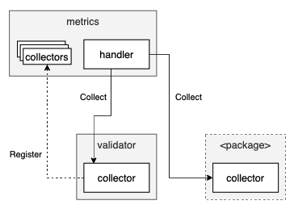

[](https://www.bloxstaking.com/)

<br>
<br>


# SSV - Metrics

`GET /metrics` end-point is exposing metrics from ssv node to prometheus, and later on to be visualized in grafana.

### Design

The metrics will be collected on demand, triggered by an HTTP request and processed by the `Handler`,
which then invokes agents (aka `collectors`) that reside in each package that needs to expose some metrics. \
Collectors implements `Collector` interface, and needs to be registered by the containing package.
Once registered, a collector will be invoked on metrics requests.




### Collected Metrics

The following is a list of all collected metrics in SSV, grouped by containing package:

#### Validator

* `count_validators{}`
* `all_connected_peers{}`
* `validator_connected_peers{pubKey}`
* `ibft_instance_state{identifier,round,stage} seq_number`
* `running_ibfts_validator_count{pubKey}`
* `running_ibfts_count{}`

### Usage

```shell
$ curl http://localhost:15001/metrics
```

Example output:

```
ssv-collect.validator.count_validators{} 3
ssv-collect.validator.ibft_instance_state{identifier="82e9b36feb8147d3f82c1a03ba246d4a63ac1ce0b1dabbb6991940a06401ab46fb4afbf971a3c145fdad2d4bddd30e12_ATTESTER",stage="Prepare",round="1"} 105
ssv-collect.validator.running_ibfts_validator_count{pubKey="82e9b36feb8147d3f82c1a03ba246d4a63ac1ce0b1dabbb6991940a06401ab46fb4afbf971a3c145fdad2d4bddd30e12"} 1
ssv-collect.validator.validator_connected_peers{pubKey="82e9b36feb8147d3f82c1a03ba246d4a63ac1ce0b1dabbb6991940a06401ab46fb4afbf971a3c145fdad2d4bddd30e12"} 3
ssv-collect.validator.running_ibfts_validator_count{pubKey="8ed3a53383a2c9b9ab0ab5437985ac443a8d50bf50b5f69eeaf9850285aeaad703beff14e3d15b4e6b5702f446a97db4"} 0
ssv-collect.validator.validator_connected_peers{pubKey="8ed3a53383a2c9b9ab0ab5437985ac443a8d50bf50b5f69eeaf9850285aeaad703beff14e3d15b4e6b5702f446a97db4"} 3
ssv-collect.validator.ibft_instance_state{identifier="afc37265308c7adf734e6d2358bf2458943ee4b2c8598f115c434ea801f13dfa4706efde6c468b0979372d9cd61b14f7_ATTESTER",stage="Prepare",round="1"} 109
ssv-collect.validator.running_ibfts_validator_count{pubKey="afc37265308c7adf734e6d2358bf2458943ee4b2c8598f115c434ea801f13dfa4706efde6c468b0979372d9cd61b14f7"} 1
ssv-collect.validator.validator_connected_peers{pubKey="afc37265308c7adf734e6d2358bf2458943ee4b2c8598f115c434ea801f13dfa4706efde6c468b0979372d9cd61b14f7"} 3
ssv-collect.validator.all_connected_peers{} 3
ssv-collect.validator.running_ibfts_count{} 2
```
