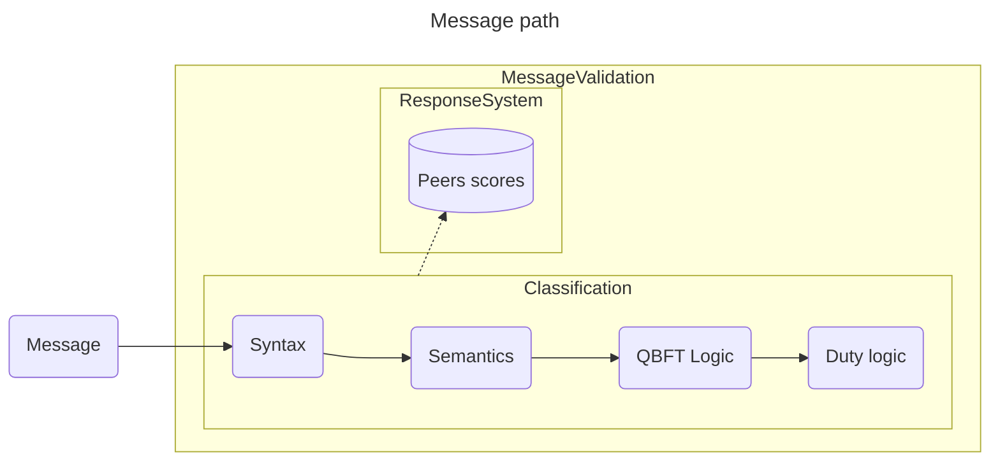

# Message Validation Structure

### Problem

Current node implementation is susceptible to network attacks.
- Example: a malicious node can send several messages to the subnet, causing a DoS attack.
- Main target of such network attacks may be the BLS verificatoin task, which is cpu consuming (on average 5ms).

### Goal

Design a Message Validation mechanism to prevent DoS attacks. This mechanism will rely on
- Syntax (format) verification
- Semantic verification
- Knowledge of expected messages according to qbft's logic
- Knowledge of expected messages according to duty's logic

## Attacker specification

> An attacker is any node acting differently from the defined behaviour by ssv.

- An attacker may have taken control of a node, possessing a share key.
- It can be a malicious network scheduler, delaying or tampering messages.
- An attacker can't, however, produce an impersonation attack (to be able to produce a digital signature of a key it doesn't have).

## Classifier abstraction

A main component of the mechanism can be abstracted as a classifier. The possible classifications are:
- "Accept": for messages that passes through all filters.
- "Reject": for messages that either
    - go against the protocol specification (malicious)
    - are invalid
    - may be an attempt of a DoS attack.
    
    The sender should be penalized.

- "Ignore": valid messages that shouldn't be processed but doesn't harm the protocol (as non-committee validator messages).

> **Note**
> This classification is due to the `libp2p/go-libp2p-pubsub` validation classification.

The main classifier metric we should care is:
- Recall (Sensitivity): ratio of true positives from all positive samples (the lower the recall, the more honest messages we decided to reject or ignore).

For our context, the classifier may tolerate processing some malicious messages but it **must** process every honest message. Therefore, the recall (or sensitivity) metric over "Accept" messages should be the one focused by the classifier.

Note: though the recall should be optimized, the response system below is a mechanism that avoids receiving subsequent non honest messages.

## Response systems

Using a good classifier, the response system will actually combat and prevent DoS attacks.

It accomplishes this by:
- associating a `rejection score` (a non-negative value) to each peer in the network.
- stop listening to a peer, for a certain time frame, when its score is bigger than a certain threshold value.
- increasing the rejection score when messages are rejected.
- decreasing the rejection score upon honest messages.

The scores can be reset or updated on each epoch, slot or QBFT round.

There's room for flexibility but we propose:
- an start rejection score of 0.
- a threhsold of 30.
- a decrease of 2 per honest messages.

The increment amount on the rejection score due to a rejected messages is determined by the rejection rule.

## Classifier structure

- The classifier shall be built on top of rules.
- If the message doesn't pass a certain rule, the rule triggers a classification tag and an error for this message.
- If a message is accepted by every rule, it's considered a valid message.

## Rules

- Each rule has a classication tag, a code and an associate rejection score.
- **Ethereum Alignment:** Every rule should respect the Ethereum consensus specification. In other words, no rule should prevent a message following a normal case of any Beacon duty, collaborating with the sensitivity metrics.
- The rule's score is pre-defines and was determined according to the maliciousness of the message.
- The list are divided in the following categories:
    - Syntax
    - Semantics
        - Partial Signature specific semantics
        - QBFT specific semantics
    - QBFT logic
    - Duty logic
        - Attestation specific
        - Attestation Aggregation specific
        - Proposer specific
        - Sync committee specific
        - Sync committee aggregator specific

## Overview    

## List of Rules

### Syntax

| Verification | Error | Classification | Score |
| ------ | ----| ---- | --- |
| Bad signed message format (can't decode) | ERR_BAD_SIG_MSG_FORMAT | Ignore | - |
| Bad message format (can't decode) with valid signature | ERR_BAD_MSG_FORMAT_WITH_VALID_SIG | Reject | 10 |
| Bad message format (can't decode) with invalid signature | ERR_BAD_MSG_FORMAT_WITH_INVALID_SIG | Reject | 3 |
| No data | ERR_NO_DATA | Reject | 5 |

- ERR_BAD_SIG_MSG_FORMAT: signed message can't be decoded. It can have been tampered.
- ERR_BAD_MSG_FORMAT_WITH_VALID_SIG: message can't be decoded. Since signature matchs, signer sent a malicious message.
- ERR_BAD_MSG_FORMAT_WITH_INVALID_SIG: message can't be decoded but signature is also wrong. Message may have been tampered.
- ERR_NO_DATA: SSV message with empty data. May have been tampered. (protocol/v2/ssv/validator/validator.go#validateMessage)

### Semantics

| Verification | Error | Classification | Score |
| ------ | ----| ---- | --- |
| Validator ID mismatch | ERR_VALIDATOR_ID_MISMATCH | Reject | 5 |
| Wrong Signature Size  |   ERR_SIG_SIZE | Reject | 5 |
| Wrong Signer ID | ERR_SIG_ID | Reject | 5 |
| Wrong Singature | ERR_WRONG_SIG | Reject | 5 |
| No Signer | ERR_NO_SIG | Reject | 5 |
| Non Unique Signer | ERR_NON_UNIQUE_SIG | Reject | 5 |
| Signers Not Sorted | ERR_SIGNERS_NOT_SORTED | Reject | 5 |
| Validator Liquidated | ERR_VALIDATOR_LIQUIDATED | Reject | 5 |

- ERR_VALIDATOR_ID_MISMATCH: Validator PubKey mismatch. May have been sent by peer that belongs to subnet but works for other validator (?).
- ERR_SIG_SIZE: Signature size is invalid. May have been tampered.
- ERR_SIG_ID: Signer ID is 0 or any other value not recognized. Message may have been tampered.
- ERR_WRONG_SIG: Signature mismatch. Message may have been tampered.
- ERR_NO_SIG: No signer in the message. Message can have been tampered.
- ERR_NON_UNIQUE_SIG: List of signer contains duplicate signer. Message can have been tampered.
- ERR_SIGNERS_NOT_SORTED: List of signers isn't sorted.
- ERR_VALIDATOR_LIQUIDATED: Validator ID was liquidated.

**Partial Signature Specific messages:**

| Verification | Error | Classification | Score |
| ------ | ----| ---- | --- |
| Above maximum size | ERR_PSIG_MSG_SIZE | Reject | 10 |
| Inconsistent signer | ERR_PSIG_INCONSISTENT_SIGNER | Ignore | - |
| Wrong Slot | ERR_PSIG_WRONG_SLOT | Reject | 15 |

- ERR_PSIG_MSG_SIZE: Message is above the allowed size. Maybe attempting to fill up peer memory.
- ERR_PSIG_INCONSISTENT_SIGNER: multiple messages with different signers (?). (ssv-spec/types/partial_sig_message.go)
- ERR_PSIG_WRONG_SLOT: Message contains wrong slot.

**QBFT Specific messages:**

| Verification | Error | Classification | Score |
| ------ | ----| ---- | --- |
| Invalid Message type | ERR_CONS_INVALID_MSG_TYPE | Reject | 15 |
| Wrong Slot (old Height) | ERR_CONS_WRONG_SLOT | Reject | 10 |
| Invalid Round | ERR_CONS_INVALID_ROUND | Reject | 15 |
| Above maximum size | ERR_CONS_MSG_SIZE | Reject | 15 |
| Multiple signers | ERR_CONS_MULTI_SIG | Reject | 5 |
| Invalid Identifier | ERR_CONS_INVALID_ID | Reject | 5 |

- ERR_CONS_INVALID_MSG_TYPE: Unknown type.
- ERR_CONS_WRONG_SLOT: Wrong slot.
- ERR_CONS_INVALID_ROUND: Invalid value for round.
- ERR_CONS_MSG_SIZE: Message above size limit.
- ERR_CONS_MULTI_SIG: Non decided message with multiple signers.
- ERR_CONS_INVALID_ID: Unknown identifier.
### QBFT Logic

| Verification | Error | Classification | Score |
| ------ | ----| ---- | --- |
| Not leader | ERR_CONS_NOT_LEADER | Reject | 15 |
| Wrong Hash _(removed)_ | ERR_CONS_WRONG_HASH | Reject | 5 |
| Invalid Proposal | ERR_CONS_INVALID_PROPOSAL | Reject | 15 |
| Invalid RC Justification | ERR_CONS_INVALID_RC_JUSTIFICATION | Reject | 15 |
| Doubled proposal with different data | ERR_CONS_DOUBLE_PROPOSAL_DATA | Reject | 20 |
| Doubled proposal | ERR_CONS_DOUBLE_PROPOSAL | Ignore | 3 |
| Doubled prepare | ERR_CONS_DOUBLE_PREPARE | Ignore | 3 |
| Doubled commit | ERR_CONS_DOUBLE_COMMIT | Ignore | 3 |
| Doubled round-change with different data | ERR_CONS_DOUBLE_ROUND_CHANGE_DATA | Reject | 20 |
| Doubled round-change | ERR_CONS_DOUBLE_ROUND_CHANGE | Ignore | 3 |
| Old message | ERR_CONS_OLD_ROUND | Ignore | 2 |
| Impossible future message | ERR_CONS_IMPOSSIBLE_FUTURE_MSG | Reject | 20 |

- ERR_CONS_NOT_LEADER: Non leader making proposals.
- ERR_CONS_WRONG_HASH: (removed)Prepare or commit message with hash different from the one stored as the proposal message. Leader could have sent different proposals.
- ERR_CONS_INVALID_PROPOSAL: Proposal has invalid justification.
- ERR_CONS_INVALID_ROUND_CHANGE: Round-Change with invalid justification.
- ERR_CONS_DOUBLE_PROPOSAL_DATA: Leader sent two different proposal messages.
- ERR_CONS_DOUBLE_PROPOSAL: Proposal duplicated. Network scheduler may have duplicated the message.
- ERR_CONS_DOUBLE_PREPARE: Prepare duplicated. Network scheduler may have duplicated the message.
- ERR_CONS_DOUBLE_COMMIT: Commit duplicated. Network scheduler may have duplicated the message.
- ERR_CONS_DOUBLE_ROUND_CHANGE_DATA: Two different Round-Change for the same round sent by the same signer.
- ERR_CONS_DOUBLE_ROUND_CHANGE: Round-Change duplicated. Network scheduler may have duplicated the message.
- ERR_CONS_OLD_ROUND: Message that is two or more rounds old.
- ERR_CONS_IMPOSSIBLE_FUTURE_MSG: Message with impossible round due to maximum possible round.

### Duty general rules

| Verification | Error | Classification | Score |
| ------ | ----| ---- | --- |
| Old QBFT message | ERR_OLD_CONS_MSG | Ignore | - |
| Decided message without quorum | ERR_DECIDED_WITHOUT_QUORUM | Reject | 10 |
| Decided message mismatch | ERR_DECIDED_MISMATCH | Reject | 5 |
| More than f+1 decided messages | ERR_TOO_MANY_DECIDED | Reject | 10 |
| Doubled pre-consensus with different data | ERR_DOUBLE_PRE_CONSENSUS_DATA | Reject | 15 |
| Doubled pre-consensus with same data | ERR_DOUBLE_PRE_CONSENSUS | Ignore | 3 |
| Doubled post-consensus with different data | ERR_DOUBLE_POST_CONSENSUS_DATA | Reject | 15 |
| Doubled post-consensus with same data | ERR_DOUBLE_POST_CONSENSUS | Ignore | 3 |

- ERR_OLD_CONS_MSG: Qbft non decided message after instance terminated. Malicious network scheduler may have duplicated the message.
- ERR_DECIDED_WITHOUT_QUORUM: Decided message without quorum of signatures.
- ERR_DECIDED_MISMATCH: Signer sent two decided messages with different list of signatures of same size.
- ERR_TOO_MANY_DECIDED: Signer sent more than $f+1$ decided messages.
- ERR_DOUBLE_PRE_CONSENSUS_DATA: Signer sent two different pre-consensus messages.
- ERR_DOUBLE_PRE_CONSENSUS: Signer sent two equal pre-consensus messages. Network scheduler may have duplicated the message.
- ERR_DOUBLE_POST_CONSENSUS_DATA: Signer sent two different post-consensus messages.
- ERR_DOUBLE_POST_CONSENSUS: Signer sent two equal post-consensus messages. Network scheduler may have duplicated the message.

### Duty specific rules

#### Attestation

Attestations for slot N can be sent within slots $[N,N+32)$. Maximum number of rounds is 12.

| Verification | Error | Classification | Score |
| ------ | ----| ---- | --- |
| No attestation duty | ERR_NO_ATTESTATION | Reject | 10 |
| Late message | ERR_LATE_ATTESTATION_MSG | Reject | 10 |
| Impossible future round | ERR_IMPOSSIBLE_ATTESTATION_ROUND | Reject | 10 |
| Already done attestation for such epoch | ERR_DOUBLE_ATTESTATION | Reject | 10

- ERR_NO_ATTESTATION: Message sent for attestation duty but there's no current attestation duty.
- ERR_LATE_ATTESTATION_MSG: Attestation duty message sent after 2 slots from its last possible slot (32 + 2).
    - Suggestion: later the message, higher the penalty score (even for valid slots, since reward decreases).
- ERR_IMPOSSIBLE_ATTESTATION_ROUND: Impossible attestation consensus round.
- ERR_DOUBLE_ATTESTATION: Attestation for validator was already done in epoch.

#### Attestation Aggregation

Attestation Aggregation for slot N can be sent within slots $[N,N+32)$. Maximum number of rounds is 12.

| Verification | Error | Classification | Score |
| ------ | ----| ---- | --- |
| No attestation aggregation duty | ERR_NO_ATTESTATION_AGGREGATION | Reject | 10 |
| Late message | ERR_LATE_ATTESTATION_AGGREGATION_MSG | Reject | 10 |
| Impossible future round | ERR_IMPOSSIBLE_ATTESTATION_AGG_ROUND | Reject | 10 |
| Already done attestation aggreation for such epoch | ERR_DOUBLE_ATTESTATION_AGGREGATION | Reject | 10

- ERR_NO_ATTESTATION_AGGREGATION: No attestation aggregation duty.
- ERR_LATE_ATTESTATION_AGGREGATION_MSG: Attestation duty message sent after 2 slots from its last possible slot (32 + 2).
    - Same suggestion as above. Need to check on specification.
- ERR_IMPOSSIBLE_ATTESTATION_AGG_ROUND: Impossible attestation aggregation consensus round.
- ERR_DOUBLE_ATTESTATION_AGGREGATION: Attestation aggregation already done for validator was already done in epoch.

#### Proposal

Proposal must be sent in the same slot. Maximum of 6 rounds.

| Verification | Error | Classification | Score |
| ------ | ----| ---- | --- |
| No proposal duty | ERR_NO_PROPOSAL | Reject | 10 |
| Late message | ERR_LATE_PROPOSAL_MSG | Reject | 10 |
| Impossible future round | ERR_IMPOSSIBLE_ATTESTATION_AGG_ROUND | Reject | 10 |

- ERR_NO_PROPOSAL: No proposal duty.
- ERR_LATE_PROPOSAL_MSG: Proposal duty message sent after 2 slots from its original slot.
- ERR_IMPOSSIBLE_ATTESTATION_AGG_ROUND: Impossible proposal round.

#### Sync Committee

Proposal must be sent in the same slot. Maximum of 6 rounds.

| Verification | Error | Classification | Score |
| ------ | ----| ---- | --- |
| No sync committee duty | ERR_NO_SYNC_COMMITTEE | Reject | 10 |
| Late message | ERR_LATE_SYNC_COMMITTEE_MSG | Reject | 10 |
| Impossible future round | ERR_IMPOSSIBLE_SYNC_COMMITTEE_ROUND | Reject | 10 |

- ERR_NO_SYNC_COMMITTEE: No sync committee duty.
- ERR_LATE_SYNC_COMMITTEE_MSG: Sync committee duty message sent after 2 slots from its original slot.
- ERR_IMPOSSIBLE_SYNC_COMMITTEE_ROUND: Impossible sync committee round.

#### Sync Committee Aggregator

Proposal must be sent in the same slot. Maximum of 6 rounds.

| Verification | Error | Classification | Score |
| ------ | ----| ---- | --- |
| No sync committee aggregator duty | ERR_NO_SYNC_COMMITTEE_AGGREGATOR | Reject | 10 |
| Late message | ERR_LATE_SYNC_COMMITTEE_AGGREGATOR_MSG | Reject |10 |
| Impossible future round | ERR_IMPOSSIBLE_SYNC_COMMITTEE_AGG_ROUND | Reject | 10 |

- ERR_NO_SYNC_COMMITTEE_AGGREGATOR: No sync committee aggregator duty.
- ERR_LATE_SYNC_COMMITTEE_AGGREGATOR_MSG: Sync committee aggrgeator duty message sent after 2 slots from its original slot.
- ERR_IMPOSSIBLE_SYNC_COMMITTEE_AGG_ROUND: Impossible sync committee aggregator round.

##### Rules suggestions for future
- Priority-based message handling: priority based on type and sender.
- Deduplication mechanism: discard duplicate messages
- Message aggregation: aggregate similar messages (e.g. wait for quorum of prepares, commits, round-changes, partial-sig) before delivering to the app. ( -> difficult to implement)